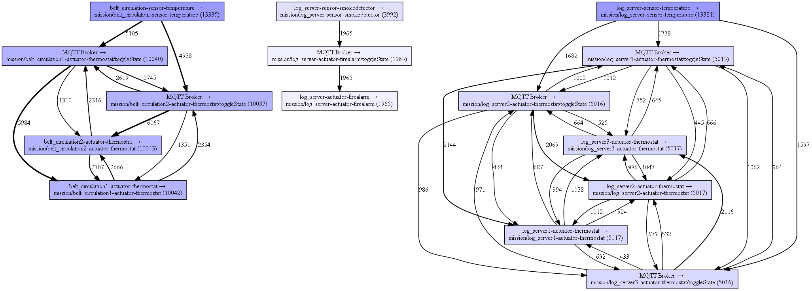
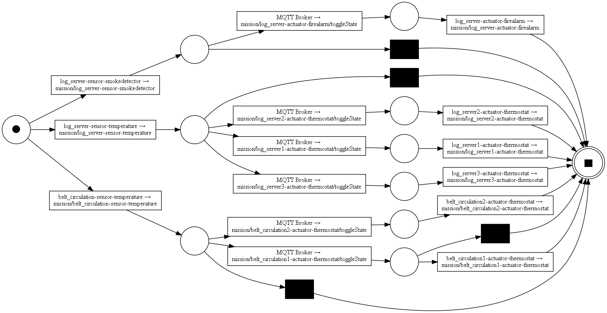
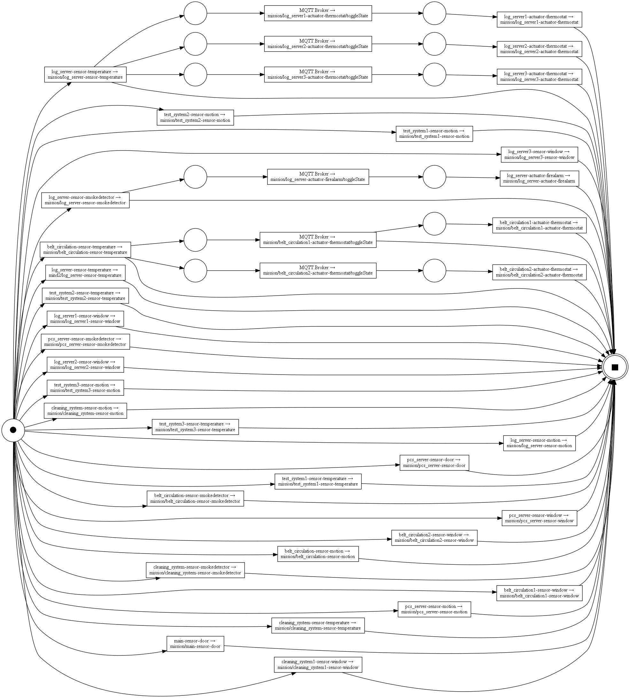
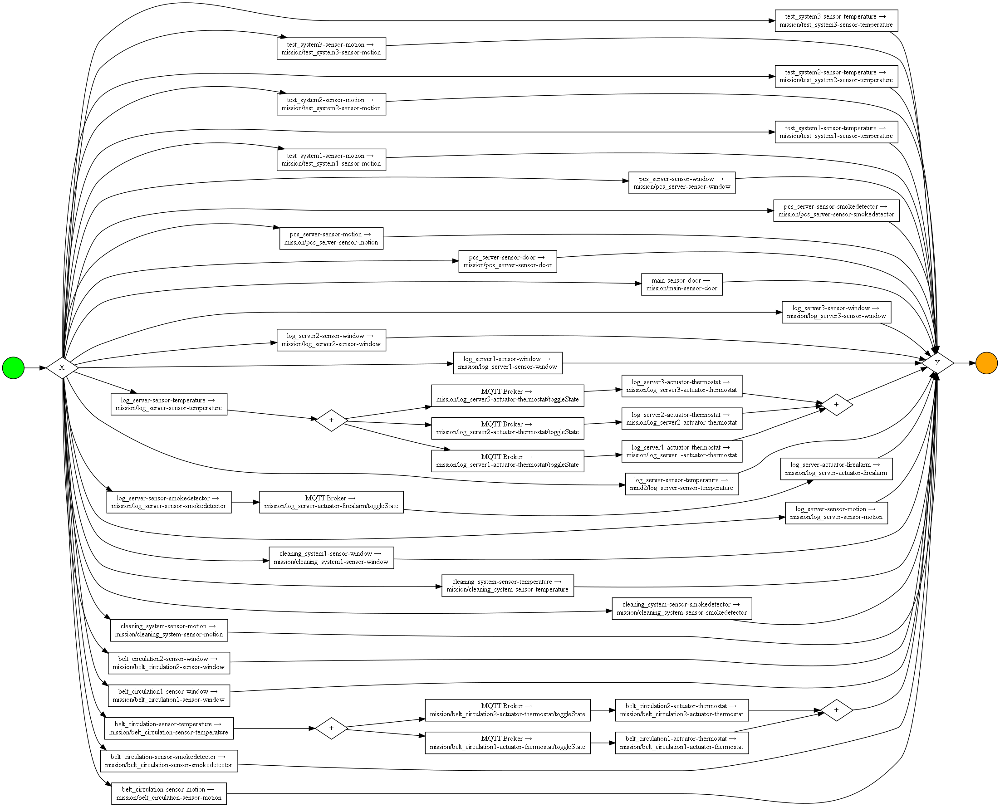

# Evaluation
## MISSION - Process Aware Intrusion Detection in IoT Networks

> Intrusion Detection Systems (IDS) allow for detecting malicious activities in organizational networks and hosts. As the Industrial Internet of Things (Industrial IoT) has gained momentum and attackers become process-aware, it elevates the focus on anomaly-based Network Intrusion Detection Systems (NIDS) in IoT. While previous research has primarily concentrated on fortifying SCADA systems with NIDS, keeping track of the latest advancements in resource-efficient messaging (e.g., MQTT, CoAP, and OPC-UA) is paramount. In our work, we straightforwardly derive IoT processes for NIDS using distributed tracing and process mining. We introduce a pioneering framework called MISSION which effectively captures, consolidates, and models MQTT flows, leading to a heightened process awareness in NIDS. Through our prototypical implementation, we demonstrate exceptional performance and high-quality models. Moreover, our experiments provide empirical evidence for rediscovering pre-defined processes and successfully detecting two distinct MQTT attacks in a simulated IoT network. 

## (0.1) Imports


```python
import pandas as pd
import pm4py
import numpy as np
from pm4py.util import constants
from IPython.display import display
from IPython.display import Image
from pm4py.algo.filtering.dfg import dfg_filtering
from pm4py.visualization.dfg import visualizer as dfg_visualizer
from pm4py.algo.evaluation.generalization import algorithm as generalization_evaluator
from pm4py.algo.evaluation.simplicity import algorithm as simplicity_evaluator
from pm4py.algo.conformance.tokenreplay.diagnostics import root_cause_analysis
from pm4py.visualization.decisiontree import visualizer as dt_vis
from pm4py.algo.transformation.log_to_features import algorithm as log_to_features
from pm4py.algo.conformance.alignments.petri_net import algorithm as alignments
from pm4py.algo.conformance import alignments as conformance_alignments
from pm4py.algo.discovery.log_skeleton import algorithm as lsk_discovery
from pm4py.algo.conformance.log_skeleton import algorithm as lsk_conformance
from pm4py.algo.conformance.tokenreplay.diagnostics import duration_diagnostics
from pm4py.algo.organizational_mining.sna import util
from pm4py.algo.conformance.tokenreplay import algorithm as token_based_replay
from pm4py.statistics.traces.generic.log import case_arrival
from pm4py.algo.organizational_mining.local_diagnostics import algorithm as local_diagnostics
from pm4py.objects.conversion.process_tree import converter as pt_converter
from pm4py.algo.discovery.temporal_profile import algorithm as temporal_profile_discovery
from pm4py.algo.conformance.temporal_profile import algorithm as temporal_profile_conformance
from pm4py.visualization.petri_net import visualizer as pn_visualizer
from sklearn.decomposition import PCA
from sklearn.ensemble import IsolationForest
from pm4py.statistics.traces.generic.log import case_statistics
from pm4py.visualization.graphs import visualizer as graphs_visualizer
from pm4py.statistics.variants.log import get as variants_module
from pm4py.algo.simulation.playout.petri_net import algorithm as simulator
from pm4py.algo.evaluation.earth_mover_distance import algorithm as emd_evaluator
from pm4py.algo.analysis.woflan import algorithm as woflan
import seaborn as sns
```

##  (0.2) User Definitions


```python
# User definitions
filename = 'resources/flows.csv'
filename_malicious_DoS = 'resources/flows-malicious-DoS.csv'
filename_malicious_sidechannel = 'resources/flows-malicious-sidechannel.csv'
mqtt_brokers = ["192.168.2.171:1883"]
node_red = "192.168.2.172:58405"
ip_filter = ["10.10.2.14"]
```

## (0.3) Mappings


```python
control_types = {1: "connect", 3: "publish", 8: "subscribe", 10: "unsubscribe", 12: "ping", 14: "disconnect"}
db_updates = []
client_ids_mapping = {}
for broker_key in mqtt_brokers:
    client_ids_mapping[broker_key] = "MQTT Broker"
```

## (1.0) Import CSV


```python
df_flows = pd.read_csv(filename, nrows=file_lines)
df_flows.head()
```


<div>
<table border="1" class="dataframe">
  <thead>
    <tr style="text-align: right;">
      <th></th>
      <th>_id</th>
      <th>sourceIPv4Address</th>
      <th>sourceTransportPort</th>
      <th>destinationIPv4Address</th>
      <th>destinationTransportPort</th>
      <th>protocol</th>
      <th>flowStartNanoseconds</th>
      <th>flowEndNanoseconds</th>
      <th>flowDurationMicroseconds</th>
      <th>mqttTopic</th>
      <th>mqttPacketId</th>
      <th>mqttQoS</th>
      <th>mqttControlType</th>
      <th>mqttSrcClientId</th>
      <th>mqttDstClientId</th>
      <th>mqttCorrelationData</th>
    </tr>
  </thead>
  <tbody>
    <tr>
      <th>0</th>
      <td>632b11105cbea7a3bc1db846</td>
      <td>192.168.2.172</td>
      <td>54097</td>
      <td>192.168.2.171</td>
      <td>1883</td>
      <td>6</td>
      <td>[1663766799,4186858496]</td>
      <td>[1663766799,4187292672]</td>
      <td>0</td>
      <td>NaN</td>
      <td>0</td>
      <td>0</td>
      <td>1</td>
      <td>livingroom-sensor-temperature</td>
      <td>Unknown client, probably a broker.</td>
      <td>NaN</td>
    </tr>
    <tr>
      <th>1</th>
      <td>632b11105cbea7a3bc1db847</td>
      <td>192.168.2.172</td>
      <td>48535</td>
      <td>192.168.2.171</td>
      <td>1883</td>
      <td>6</td>
      <td>[1663766799,4194340864]</td>
      <td>[1663766799,4194603008]</td>
      <td>0</td>
      <td>NaN</td>
      <td>0</td>
      <td>0</td>
      <td>1</td>
      <td>kitchen-sensor-temperature</td>
      <td>Unknown client, probably a broker.</td>
      <td>NaN</td>
    </tr>
    <tr>
      <th>2</th>
      <td>632b11105cbea7a3bc1db848</td>
      <td>192.168.2.172</td>
      <td>54097</td>
      <td>192.168.2.171</td>
      <td>1883</td>
      <td>6</td>
      <td>[1663766799,4193241088]</td>
      <td>[1663766799,4195409920]</td>
      <td>1</td>
      <td>mind2/livingroom-sensor-temperature</td>
      <td>1</td>
      <td>2</td>
      <td>3</td>
      <td>livingroom-sensor-temperature</td>
      <td>Unknown client, probably a broker.</td>
      <td>06857822-39b1-11ed-a47e-3be7a6e67cf0</td>
    </tr>
    <tr>
      <th>3</th>
      <td>632b11105cbea7a3bc1db849</td>
      <td>192.168.2.172</td>
      <td>38513</td>
      <td>192.168.2.171</td>
      <td>1883</td>
      <td>6</td>
      <td>[1663766799,4202084352]</td>
      <td>[1663766799,4202526720]</td>
      <td>0</td>
      <td>NaN</td>
      <td>0</td>
      <td>0</td>
      <td>1</td>
      <td>bathroom-sensor-temperature</td>
      <td>Unknown client, probably a broker.</td>
      <td>NaN</td>
    </tr>
    <tr>
      <th>4</th>
      <td>632b11105cbea7a3bc1db84a</td>
      <td>192.168.2.172</td>
      <td>48535</td>
      <td>192.168.2.171</td>
      <td>1883</td>
      <td>6</td>
      <td>[1663766799,4200988672]</td>
      <td>[1663766799,4203681792]</td>
      <td>1</td>
      <td>mission/kitchen-sensor-temperature</td>
      <td>1</td>
      <td>2</td>
      <td>3</td>
      <td>kitchen-sensor-temperature</td>
      <td>Unknown client, probably a broker.</td>
      <td>0685c91c-39b1-11ed-a47e-3be7a6e67cf0</td>
    </tr>
  </tbody>
</table>
</div>


## (2.0) Prerequisites

### (2.1) Data Cleaning & Preprocessing


```python
def preprocessing(df_flows):
    for index, flow in df_flows.iterrows():  

        # check if row has a client identifier
        if 'mqttSrcClientId' in flow:
            src_key = f"{flow['sourceIPv4Address']}:{flow['sourceTransportPort']}"
            dst_key = f"{flow['destinationIPv4Address']}:{flow['destinationTransportPort']}"

            # check if source or destination is a MQTT broker's address
            if src_key in mqtt_brokers and "MQTT Broker" not in df_flows.loc[index,'mqttSrcClientId']:
                df_flows.loc[index,'mqttSrcClientId'] = client_ids_mapping[src_key]
            if dst_key in mqtt_brokers and "MQTT Broker" not in df_flows.loc[index,'mqttDstClientId']:
                df_flows.loc[index,'mqttDstClientId'] = client_ids_mapping[dst_key]

            # check if client identifier is unknown
            if "Unknown" in df_flows.loc[index,'mqttSrcClientId']:
                df_flows.loc[index,'mqttSrcClientId'] = src_key
            if "Unknown" in df_flows.loc[index,'mqttDstClientId']:
                df_flows.loc[index,'mqttDstClientId'] = dst_key

            # check if client has already been mapped
            if src_key not in client_ids_mapping:
                client_ids_mapping[src_key] = df_flows.loc[index,'mqttSrcClientId']
            if dst_key not in client_ids_mapping:
                client_ids_mapping[dst_key] = df_flows.loc[index,'mqttDstClientId']
            
            if src_key == node_red:
                df_flows.loc[index,'mqttSrcClientId'] = "Node-RED"

        # flow has not a client identifier
        else: 
            src_key = f"{flow['sourceIPv4Address']}:{flow['sourceTransportPort']}"
            dst_key = f"{flow['destinationIPv4Address']}:{flow['destinationTransportPort']}"

            if src_key in client_ids_mapping:
                df_flows.loc[index,'mqttSrcClientId'] = client_ids_mapping[src_key]
            else:
                df_flows.loc[index,'mqttSrcClientId'] = src_key
            if dst_key in client_ids_mapping:
                df_flows.loc[index,'mqttDstClientId'] = client_ids_mapping[dst_key]
            else:
                df_flows.loc[index,'mqttDstClientId'] = dst_key

            if src_key == node_red:
                df_flows.loc[index,'mqttSrcClientId'] = "Node-RED"

        # fix timestamp array received from MongoDB
        flow['flowStartNanoseconds'] = flow['flowStartNanoseconds'][1:-1]
        flow['flowEndNanoseconds'] = flow['flowEndNanoseconds'][1:-1]
        flow['flowStartNanoseconds'] = flow['flowStartNanoseconds'].split(",")
        flow['flowEndNanoseconds'] = flow['flowEndNanoseconds'].split(",")
        flow['flowStartNanoseconds'] = float(flow['flowStartNanoseconds'][0] + "." + flow['flowStartNanoseconds'][1])
        flow['flowEndNanoseconds'] = float(flow['flowEndNanoseconds'][0] + "." + flow['flowEndNanoseconds'][1])
        df_flows.loc[index,'flowStartNanoseconds'] = pd.Timestamp.fromtimestamp(flow['flowStartNanoseconds'])
        df_flows.loc[index,'flowEndNanoseconds'] = pd.Timestamp.fromtimestamp(flow['flowEndNanoseconds'])

    df_flows.fillna("no correlation",inplace=True)
    df_flows.sort_values(by=['flowStartNanoseconds'])
    return df_flows

df_flows = preprocessing(df_flows)
df_flows.head()
```


<div>
<table border="1" class="dataframe">
  <thead>
    <tr style="text-align: right;">
      <th></th>
      <th>_id</th>
      <th>sourceIPv4Address</th>
      <th>sourceTransportPort</th>
      <th>destinationIPv4Address</th>
      <th>destinationTransportPort</th>
      <th>protocol</th>
      <th>flowStartNanoseconds</th>
      <th>flowEndNanoseconds</th>
      <th>flowDurationMicroseconds</th>
      <th>mqttTopic</th>
      <th>mqttPacketId</th>
      <th>mqttQoS</th>
      <th>mqttControlType</th>
      <th>mqttSrcClientId</th>
      <th>mqttDstClientId</th>
      <th>mqttCorrelationData</th>
    </tr>
  </thead>
  <tbody>
    <tr>
      <th>0</th>
      <td>632b11105cbea7a3bc1db846</td>
      <td>192.168.2.172</td>
      <td>54097</td>
      <td>192.168.2.171</td>
      <td>1883</td>
      <td>6</td>
      <td>2022-09-21 15:26:39.418686</td>
      <td>2022-09-21 15:26:39.418729</td>
      <td>0</td>
      <td>no correlation</td>
      <td>0</td>
      <td>0</td>
      <td>1</td>
      <td>livingroom-sensor-temperature</td>
      <td>MQTT Broker</td>
      <td>no correlation</td>
    </tr>
    <tr>
      <th>1</th>
      <td>632b11105cbea7a3bc1db847</td>
      <td>192.168.2.172</td>
      <td>48535</td>
      <td>192.168.2.171</td>
      <td>1883</td>
      <td>6</td>
      <td>2022-09-21 15:26:39.419434</td>
      <td>2022-09-21 15:26:39.419460</td>
      <td>0</td>
      <td>no correlation</td>
      <td>0</td>
      <td>0</td>
      <td>1</td>
      <td>kitchen-sensor-temperature</td>
      <td>MQTT Broker</td>
      <td>no correlation</td>
    </tr>
    <tr>
      <th>2</th>
      <td>632b11105cbea7a3bc1db848</td>
      <td>192.168.2.172</td>
      <td>54097</td>
      <td>192.168.2.171</td>
      <td>1883</td>
      <td>6</td>
      <td>2022-09-21 15:26:39.419324</td>
      <td>2022-09-21 15:26:39.419541</td>
      <td>1</td>
      <td>mind2/livingroom-sensor-temperature</td>
      <td>1</td>
      <td>2</td>
      <td>3</td>
      <td>livingroom-sensor-temperature</td>
      <td>MQTT Broker</td>
      <td>06857822-39b1-11ed-a47e-3be7a6e67cf0</td>
    </tr>
    <tr>
      <th>3</th>
      <td>632b11105cbea7a3bc1db849</td>
      <td>192.168.2.172</td>
      <td>38513</td>
      <td>192.168.2.171</td>
      <td>1883</td>
      <td>6</td>
      <td>2022-09-21 15:26:39.420208</td>
      <td>2022-09-21 15:26:39.420253</td>
      <td>0</td>
      <td>no correlation</td>
      <td>0</td>
      <td>0</td>
      <td>1</td>
      <td>bathroom-sensor-temperature</td>
      <td>MQTT Broker</td>
      <td>no correlation</td>
    </tr>
    <tr>
      <th>4</th>
      <td>632b11105cbea7a3bc1db84a</td>
      <td>192.168.2.172</td>
      <td>48535</td>
      <td>192.168.2.171</td>
      <td>1883</td>
      <td>6</td>
      <td>2022-09-21 15:26:39.420099</td>
      <td>2022-09-21 15:26:39.420368</td>
      <td>1</td>
      <td>mission/kitchen-sensor-temperature</td>
      <td>1</td>
      <td>2</td>
      <td>3</td>
      <td>kitchen-sensor-temperature</td>
      <td>MQTT Broker</td>
      <td>0685c91c-39b1-11ed-a47e-3be7a6e67cf0</td>
    </tr>
  </tbody>
</table>
</div>


### (2.2)  Event Log Conversion


```python
def event_log_conversion(df_flows):
    event_log = []

    # Consider only publish flows
    for index, flow in df_flows.iterrows():
        if int(flow['mqttControlType']) == 3 and flow['mqttCorrelationData'] != "no correlation":
            # Create activity string
            activity = f"{flow['mqttSrcClientId']} \u2192 \n{flow['mqttTopic']}"

            # Append event data to the event log list
            event_log.append([
                flow['flowStartNanoseconds'],  # Time
                flow['mqttCorrelationData'],  # Case concept name
                flow['mqttSrcClientId'],  # Org resource
                activity  # Concept name
            ])

    # Convert event log list to DataFrame
    df_event_log = pd.DataFrame(event_log, columns=['time:timestamp', 'case:concept:name', 'org:resource', 'concept:name'])

    # Convert DataFrame to PM4Py event log format and return both formats
    return pm4py.convert_to_event_log(df_event_log), df_event_log
```


```python
event_log, df_event_log = event_log_conversion(df_flows)
df_event_log.head()
```


<div>
<table border="1" class="dataframe">
  <thead>
    <tr style="text-align: right;">
      <th></th>
      <th>time:timestamp</th>
      <th>case:concept:name</th>
      <th>org:resource</th>
      <th>concept:name</th>
    </tr>
  </thead>
  <tbody>
    <tr>
      <th>0</th>
      <td>2022-09-21 15:26:39.419324</td>
      <td>06857822-39b1-11ed-a47e-3be7a6e67cf0</td>
      <td>livingroom-sensor-temperature</td>
      <td>livingroom-sensor-temperature → \nmind2/living...</td>
    </tr>
    <tr>
      <th>1</th>
      <td>2022-09-21 15:26:39.420099</td>
      <td>0685c91c-39b1-11ed-a47e-3be7a6e67cf0</td>
      <td>kitchen-sensor-temperature</td>
      <td>kitchen-sensor-temperature → \nmission/kitchen...</td>
    </tr>
    <tr>
      <th>2</th>
      <td>2022-09-21 15:26:39.420679</td>
      <td>0685ffd6-39b1-11ed-a47e-3be7a6e67cf0</td>
      <td>bathroom-sensor-temperature</td>
      <td>bathroom-sensor-temperature → \nmission/bathro...</td>
    </tr>
    <tr>
      <th>3</th>
      <td>2022-09-21 15:26:39.422263</td>
      <td>06868e1a-39b1-11ed-a47e-3be7a6e67cf0</td>
      <td>garden1-sensor-temperature</td>
      <td>garden1-sensor-temperature → \nmission/garden1...</td>
    </tr>
    <tr>
      <th>4</th>
      <td>2022-09-21 15:26:39.422987</td>
      <td>0686c8bc-39b1-11ed-a47e-3be7a6e67cf0</td>
      <td>garden2-sensor-temperature</td>
      <td>garden2-sensor-temperature → \nmission/garden2...</td>
    </tr>
  </tbody>
</table>
</div>


## (3.0) Process Mining

###  (3.1) Directly Follows Graphs


```python
_df, _sa, _ea = pm4py.discover_directly_follows_graph(event_log)

# Filter the directly follows graph based on activities percentage
activities_count = pm4py.get_event_attribute_values(event_log, "concept:name")
_df, _sa, _ea, activities_count = dfg_filtering.filter_dfg_on_activities_percentage(_df, _sa, _ea, activities_count, 1)

# Generate visualizations for performance and frequency variants
gviz_perf = dfg_visualizer.apply(_df, variant=dfg_visualizer.Variants.PERFORMANCE,
                                 activities_count=activities_count, parameters={"format": "png"})
gviz_freq = dfg_visualizer.apply(_df, variant=dfg_visualizer.Variants.FREQUENCY,
                                 activities_count=activities_count, parameters={"format": "png"})
gviz_freq2 = dfg_visualizer.apply(_df, variant=dfg_visualizer.Variants.FREQUENCY,
                                  activities_count=activities_count, parameters={"format": "svg"})

# Save and display the visualizations
file_lines = len(event_log)
pn_visualizer.save(gviz_freq, f"resources/dfg_flows_{file_lines}.pdf")
dfg_visualizer.view(gviz_freq)
dfg_visualizer.view(gviz_perf)
pm4py.view_dfg(_df, _sa, _ea, format="png")
```


    

    


    

    


    

    


###  (3.2) Inductive Miner


```python
# Discover Petri net using the inductive miner algorithm
im_net, im_im, im_fm = pm4py.discover_petri_net_inductive(event_log, noise_threshold=0.9)

# Generate the visualization of the Petri net
viz_variant = pm4py.visualization.petri_net.visualizer.Variants.FREQUENCY
viz_parameters = {"format": "png"}
gviz = pm4py.visualization.petri_net.visualizer.apply(im_net, im_im, im_fm, variant=viz_variant, parameters=viz_parameters)

# View the Petri net visualization
pm4py.visualization.petri_net.visualizer.view(gviz)
```


    

    


###  (3.3) Heuristic Miner


```python
# Discover Petri net using the heuristics miner algorithm
hm_net, hm_im, hm_fm = pm4py.discover_petri_net_heuristics(event_log, dependency_threshold=0.9)

# Generate the visualization of the Petri net
viz_variant = pm4py.visualization.petri_net.visualizer.Variants.FREQUENCY
viz_parameters = {"format": "png"}
gviz = pm4py.visualization.petri_net.visualizer.apply(hm_net, hm_im, hm_fm, variant=viz_variant, parameters=viz_parameters)

# View the Petri net visualization
pm4py.visualization.petri_net.visualizer.view(gviz)
```


    

    


###  (3.4) Alpha Miner


```python
# Discover Petri net using the alpha miner algorithm
am_net, am_im, am_fm = pm4py.discover_petri_net_alpha(event_log)

# Generate the visualization of the Petri net
gviz = pm4py.visualization.petri_net.visualizer.apply(am_net, am_im, am_fm, log=event_log)

# Save the Petri net visualization as a PDF file
pn_visualizer.save(gviz, "alpha-miner.pdf")

# View the Petri net visualization
pm4py.visualization.petri_net.visualizer.view(gviz)
```


    

    


### (3.5) BPMN


```python
# Discover BPMN model using the inductive miner algorithm
bpmn_model = pm4py.discover_bpmn_inductive(df_event_log, noise_threshold=0.9)

# View the BPMN model
pm4py.view_bpmn(bpmn_model)
```


    

    


##  (4.0) Process Model Quality


```python
data = []
language = variants_module.get_language(event_log)

def evaluate_petri_net(miner, log, net, im, fm):
    """
    Evaluate the quality criteria of a Petri net.
    """

    # Calculate fitness using token-based replay
    tbr_fitness = pm4py.fitness_token_based_replay(log, net, im, fm)
    fitness = round(tbr_fitness['perc_fit_traces'], 4)

    # Calculate precision using token-based replay
    etc_prec = pm4py.precision_token_based_replay(log, net, im, fm)
    precision = round(etc_prec * 100, 4)

    # Calculate generalization
    gen = generalization_evaluator.apply(log, net, im, fm)
    generalization = round(gen * 100, 4)

    # Calculate simplicity
    simp = simplicity_evaluator.apply(net)
    simplicity = round(simp * 100, 4)

    # Check soundness using Woflan algorithm
    soundness = woflan.apply(net, im, fm, parameters={woflan.Parameters.RETURN_ASAP_WHEN_NOT_SOUND: True,
                                                      woflan.Parameters.PRINT_DIAGNOSTICS: False,
                                                      woflan.Parameters.RETURN_DIAGNOSTICS: False})
    soundness = True if soundness == 1 else False

    # Print the evaluation results
    print(f"Fitness: {fitness}%")
    print(f"Precision: {precision}%")
    print(f"Generalization: {generalization}%")
    print(f"Simplicity: {simplicity}%")
    print(f"Soundness: {soundness}")

    # Store the evaluation results in the data list
    data.append((miner.title(), fitness, precision, generalization, simplicity, soundness))
```

###  (4.1) Inductive Miner


```python
evaluate_petri_net("inductive miner", event_log, im_net, im_im, im_fm)
```


    replaying log with TBR, completed variants ::   0%|          | 0/113 [00:00<?, ?it/s]


    replaying log with TBR, completed variants ::   0%|          | 0/181 [00:00<?, ?it/s]


    replaying log with TBR, completed variants ::   0%|          | 0/113 [00:00<?, ?it/s]


    C:\Users\mail\anaconda3\lib\site-packages\pm4py\util\lp\variants\scipy_solver.py:26: OptimizeWarning: A_eq does not appear to be of full row rank. To improve performance, check the problem formulation for redundant equality constraints.
      sol = linprog(c, A_ub=Aub, b_ub=bub, A_eq=Aeq, b_eq=beq, method="revised simplex")
    

    Fitness: 92.7302%
    Precision: 99.9927%
    Generalization: 93.8892%
    Simplicity: 53.3333%
    Soundness: True
    

### (4.2) Heuristic Miner


```python
evaluate_petri_net("heuristic miner", event_log, hm_net, hm_im, hm_fm)
```


    replaying log with TBR, completed variants ::   0%|          | 0/113 [00:00<?, ?it/s]


    replaying log with TBR, completed variants ::   0%|          | 0/181 [00:00<?, ?it/s]


    replaying log with TBR, completed variants ::   0%|          | 0/113 [00:00<?, ?it/s]


    Fitness: 8.2662%
    Precision: 99.9867%
    Generalization: 95.636%
    Simplicity: 69.5652%
    Soundness: False
    

### (4.3) Alpha Miner


```python
evaluate_petri_net("alpha miner", event_log, am_net, am_im, am_fm)
```


    replaying log with TBR, completed variants ::   0%|          | 0/113 [00:00<?, ?it/s]


    replaying log with TBR, completed variants ::   0%|          | 0/181 [00:00<?, ?it/s]


    replaying log with TBR, completed variants ::   0%|          | 0/113 [00:00<?, ?it/s]


    Fitness: 83.762%
    Precision: 99.9927%
    Generalization: 93.4878%
    Simplicity: 46.087%
    Soundness: False
    

### (4.4) Comparing the Miner


```python
comparison = pd.DataFrame(data, columns=['Miner', 'Fitness', 'Precision', 'Generalization', 'Simplicity', 'Soundness'])
comparison[['Fitness', 'Precision', 'Generalization', 'Simplicity', 'Soundness']] = comparison[['Fitness', 'Precision', 'Generalization', 'Simplicity', 'Soundness']].apply(pd.to_numeric)

arr = (comparison[['Fitness', 'Precision', 'Generalization', 'Simplicity']]).to_numpy()
comparison = comparison.style.highlight_max(color = 'lightgreen', subset = ['Fitness', 'Precision', 'Generalization', 'Simplicity'], axis = 0)
display(comparison)
hmp = sns.heatmap(arr, annot=True, fmt='0.0f', cmap="Greens", alpha=0.7,  square=True, cbar=False, xticklabels=['Fitness', 'Precision', 'Generalization', 'Simplicity'], yticklabels=["Inductive Miner", "Heuristic Miner", "Alpha Miner"])
fig = hmp.get_figure()
for t in hmp.texts: t.set_text(t.get_text() + "%")
fig.savefig(f"resources/heatmap_flows_{len(event_log)}.svg")
```


<table id="T_b297a">
  <thead>
    <tr>
      <th class="blank level0" >&nbsp;</th>
      <th id="T_b297a_level0_col0" class="col_heading level0 col0" >Miner</th>
      <th id="T_b297a_level0_col1" class="col_heading level0 col1" >Fitness</th>
      <th id="T_b297a_level0_col2" class="col_heading level0 col2" >Precision</th>
      <th id="T_b297a_level0_col3" class="col_heading level0 col3" >Generalization</th>
      <th id="T_b297a_level0_col4" class="col_heading level0 col4" >Simplicity</th>
      <th id="T_b297a_level0_col5" class="col_heading level0 col5" >Soundness</th>
    </tr>
  </thead>
  <tbody>
    <tr>
      <th id="T_b297a_level0_row0" class="row_heading level0 row0" >0</th>
      <td id="T_b297a_row0_col0" class="data row0 col0" >Inductive Miner</td>
      <td id="T_b297a_row0_col1" class="data row0 col1" >92.730200</td>
      <td id="T_b297a_row0_col2" class="data row0 col2" >99.992700</td>
      <td id="T_b297a_row0_col3" class="data row0 col3" >93.889200</td>
      <td id="T_b297a_row0_col4" class="data row0 col4" >53.333300</td>
      <td id="T_b297a_row0_col5" class="data row0 col5" >True</td>
    </tr>
    <tr>
      <th id="T_b297a_level0_row1" class="row_heading level0 row1" >1</th>
      <td id="T_b297a_row1_col0" class="data row1 col0" >Heuristic Miner</td>
      <td id="T_b297a_row1_col1" class="data row1 col1" >8.266200</td>
      <td id="T_b297a_row1_col2" class="data row1 col2" >99.986700</td>
      <td id="T_b297a_row1_col3" class="data row1 col3" >95.636000</td>
      <td id="T_b297a_row1_col4" class="data row1 col4" >69.565200</td>
      <td id="T_b297a_row1_col5" class="data row1 col5" >False</td>
    </tr>
    <tr>
      <th id="T_b297a_level0_row2" class="row_heading level0 row2" >2</th>
      <td id="T_b297a_row2_col0" class="data row2 col0" >Alpha Miner</td>
      <td id="T_b297a_row2_col1" class="data row2 col1" >83.762000</td>
      <td id="T_b297a_row2_col2" class="data row2 col2" >99.992700</td>
      <td id="T_b297a_row2_col3" class="data row2 col3" >93.487800</td>
      <td id="T_b297a_row2_col4" class="data row2 col4" >46.087000</td>
      <td id="T_b297a_row2_col5" class="data row2 col5" >False</td>
    </tr>
  </tbody>
</table>


    

    


### (4.5) Some Statistics of the Event Log


```python
ll_case_durations = pm4py.get_all_case_durations(event_log)
case_arrival_ratio = pm4py.get_case_arrival_average(event_log)
case_dispersion_ratio = case_arrival.get_case_dispersion_avg(event_log, parameters={case_arrival.Parameters.TIMESTAMP_KEY: "time:timestamp"})
averaged_duration = round(sum(ll_case_durations)/len(ll_case_durations),5)
data = [(averaged_duration,round(case_arrival_ratio,5),round(case_dispersion_ratio,5))]
statistics = pd.DataFrame(data, columns=['Throughput Time  (sec.)', 'Case Arrival Ratio (sec.)', 'Case Dispersion Ratio  (sec.)'])
statistics
```


<div>
<table border="1" class="dataframe">
  <thead>
    <tr style="text-align: right;">
      <th></th>
      <th>Throughput Time  (sec.)</th>
      <th>Case Arrival Ratio (sec.)</th>
      <th>Case Dispersion Ratio  (sec.)</th>
    </tr>
  </thead>
  <tbody>
    <tr>
      <th>0</th>
      <td>0.00185</td>
      <td>0.3189</td>
      <td>0.3189</td>
    </tr>
  </tbody>
</table>
</div>


```python
x, y = case_statistics.get_kde_caseduration(event_log, parameters={constants.PARAMETER_CONSTANT_TIMESTAMP_KEY: "time:timestamp"})

gviz = graphs_visualizer.apply_plot(x, y, variant=graphs_visualizer.Variants.CASES)
graphs_visualizer.view(gviz)
gviz = graphs_visualizer.apply_semilogx(x, y, variant=graphs_visualizer.Variants.CASES)
graphs_visualizer.view(gviz)
```


    

    


    

    


#  (5.0) Attack Detection


```python
def conformance_tbr(log, net, im, fm):
    """
    Performs token-based replay conformance checking and prints diagnostic information.
    """
    parameters_tbr = {
        token_based_replay.Variants.TOKEN_REPLAY.value.Parameters.DISABLE_VARIANTS: False,
        token_based_replay.Variants.TOKEN_REPLAY.value.Parameters.ENABLE_PLTR_FITNESS: True
    }

    replayed_traces, place_fitness, trans_fitness, unwanted_activities = token_based_replay.apply(log, net, im, fm, parameters=parameters_tbr)

    trans_diagnostics = duration_diagnostics.diagnose_from_trans_fitness(log, trans_fitness)
    if len(trans_diagnostics) > 0:
        print("\n########################## TRANSITION DIAGNOSTICS ########################")
        for trans in trans_diagnostics:
            print(trans, trans_diagnostics[trans])

    print("\n########################## REPLAYED TRACES ##############################")
    for trace in replayed_traces:
        print(trace)

    act_diagnostics = duration_diagnostics.diagnose_from_notexisting_activities(log, unwanted_activities)
    if len(act_diagnostics) > 0:
        print("\n########################## Activity Diagnostics ###########################")
        for act in act_diagnostics:
            print(act)


def conformance_alignment(log, net, im, fm):
    """
    Performs alignment-based conformance checking and prints the fitness score for each trace.
    """
    parameters = {
        "pm4py:param:activity_key": "concept:name",
        "pm4py:param:resource_key": "org:resource"
    }

    aligned_traces = alignments.apply_log(log, net, im, fm, parameters=parameters)

    for case in aligned_traces:
        print(case)


def conformance_log_skeleton(log):
    """
    Performs log skeleton-based conformance checking and prints anomalies if found.
    """
    skeleton = lsk_discovery.apply(log, parameters={
        lsk_discovery.Variants.CLASSIC.value.Parameters.NOISE_THRESHOLD: 0.0
    })
    conf_result = lsk_conformance.apply(log, skeleton)

    if any(not dev["is_fit"] for dev in conf_result):
        print("Anomalies:")
        for dev in conf_result:
            if not dev["is_fit"]:
                print(dev)
    else:
        print("No anomalies")

        
```

## (5.1) Scenario 1: DoS attack with the same correlation identifier or different ones

### (5.1.1) Load malicious data sample and preprocess it


```python
df_flows_malicious_dos = pd.read_csv(filename_malicious_DoS, delimiter=";")
df_flows_malicious_dos = preprocessing(df_flows_malicious_dos)
event_log_malicious_dos, df_flows_malicious_dos = event_log_conversion(df_flows_malicious_dos)
df_flows_malicious_dos.head()
```


<div>
<table border="1" class="dataframe">
  <thead>
    <tr style="text-align: right;">
      <th></th>
      <th>time:timestamp</th>
      <th>case:concept:name</th>
      <th>org:resource</th>
      <th>concept:name</th>
    </tr>
  </thead>
  <tbody>
    <tr>
      <th>0</th>
      <td>2022-09-21 15:26:40.114727</td>
      <td>1</td>
      <td>livingroom-temperature-sensor</td>
      <td>livingroom-temperature-sensor → \nmission/gard...</td>
    </tr>
    <tr>
      <th>1</th>
      <td>2022-09-21 15:26:41.114727</td>
      <td>2</td>
      <td>livingroom-temperature-sensor</td>
      <td>livingroom-temperature-sensor → \nmission/gard...</td>
    </tr>
    <tr>
      <th>2</th>
      <td>2022-09-21 15:26:43.114727</td>
      <td>3</td>
      <td>livingroom-temperature-sensor</td>
      <td>livingroom-temperature-sensor → \nmission/gard...</td>
    </tr>
    <tr>
      <th>3</th>
      <td>2022-09-21 15:26:44.114727</td>
      <td>4</td>
      <td>livingroom-temperature-sensor</td>
      <td>livingroom-temperature-sensor → \nmission/gard...</td>
    </tr>
    <tr>
      <th>4</th>
      <td>2022-09-21 15:26:45.114727</td>
      <td>5</td>
      <td>livingroom-temperature-sensor</td>
      <td>livingroom-temperature-sensor → \nmission/gard...</td>
    </tr>
  </tbody>
</table>
</div>


### (5.1.2) Procedural conformance checking

### (5.1.2.1) Token-based replay


```python
conformance_tbr(event_log_malicious_dos, am_net, am_im, am_fm)
```


    replaying log with TBR, completed variants ::   0%|          | 0/2 [00:00<?, ?it/s]


    
    ########################## REPLAYED TRACES ##############################
    {'trace_is_fit': False, 'trace_fitness': 0.0, 'activated_transitions': [], 'reached_marking': ['start:1'], 'enabled_transitions_in_marking': {(bathroom-sensor-smokedetector → 
    mission/bathroom-sensor-smokedetector, 'bathroom-sensor-smokedetector → 
    mission/bathroom-sensor-smokedetector'), (kitchen-sensor-smokedetector → 
    mission/kitchen-sensor-smokedetector, 'kitchen-sensor-smokedetector → 
    mission/kitchen-sensor-smokedetector'), (livingroom-sensor-temperature → 
    mind2/livingroom-sensor-temperature, 'livingroom-sensor-temperature → 
    mind2/livingroom-sensor-temperature'), (livingroom3-sensor-window → 
    mission/livingroom3-sensor-window, 'livingroom3-sensor-window → 
    mission/livingroom3-sensor-window'), (kitchen1-sensor-window → 
    mission/kitchen1-sensor-window, 'kitchen1-sensor-window → 
    mission/kitchen1-sensor-window'), (kitchen2-sensor-window → 
    mission/kitchen2-sensor-window, 'kitchen2-sensor-window → 
    mission/kitchen2-sensor-window'), (bathroom1-sensor-window → 
    mission/bathroom1-sensor-window, 'bathroom1-sensor-window → 
    mission/bathroom1-sensor-window'), (livingroom-sensor-smokedetector → 
    mission/livingroom-sensor-smokedetector, 'livingroom-sensor-smokedetector → 
    mission/livingroom-sensor-smokedetector'), (garage-sensor-door → 
    mission/garage-sensor-door, 'garage-sensor-door → 
    mission/garage-sensor-door'), (garage-sensor-smokedetector → 
    mission/garage-sensor-smokedetector, 'garage-sensor-smokedetector → 
    mission/garage-sensor-smokedetector'), (garden1-sensor-motion → 
    mission/garden1-sensor-motion, 'garden1-sensor-motion → 
    mission/garden1-sensor-motion'), (garden3-sensor-motion → 
    mission/garden3-sensor-motion, 'garden3-sensor-motion → 
    mission/garden3-sensor-motion'), (kitchen-sensor-temperature → 
    mission/kitchen-sensor-temperature, 'kitchen-sensor-temperature → 
    mission/kitchen-sensor-temperature'), (livingroom-sensor-temperature → 
    mission/livingroom-sensor-temperature, 'livingroom-sensor-temperature → 
    mission/livingroom-sensor-temperature'), (livingroom1-sensor-window → 
    mission/livingroom1-sensor-window, 'livingroom1-sensor-window → 
    mission/livingroom1-sensor-window'), (main-sensor-door → 
    mission/main-sensor-door, 'main-sensor-door → 
    mission/main-sensor-door'), (garden1-sensor-temperature → 
    mission/garden1-sensor-temperature, 'garden1-sensor-temperature → 
    mission/garden1-sensor-temperature'), (garden2-sensor-temperature → 
    mission/garden2-sensor-temperature, 'garden2-sensor-temperature → 
    mission/garden2-sensor-temperature'), (livingroom-sensor-motion → 
    mission/livingroom-sensor-motion, 'livingroom-sensor-motion → 
    mission/livingroom-sensor-motion'), (livingroom2-sensor-window → 
    mission/livingroom2-sensor-window, 'livingroom2-sensor-window → 
    mission/livingroom2-sensor-window'), (garage-sensor-window → 
    mission/garage-sensor-window, 'garage-sensor-window → 
    mission/garage-sensor-window'), (kitchen-sensor-motion → 
    mission/kitchen-sensor-motion, 'kitchen-sensor-motion → 
    mission/kitchen-sensor-motion'), (garden3-sensor-temperature → 
    mission/garden3-sensor-temperature, 'garden3-sensor-temperature → 
    mission/garden3-sensor-temperature'), (bathroom-sensor-motion → 
    mission/bathroom-sensor-motion, 'bathroom-sensor-motion → 
    mission/bathroom-sensor-motion'), (bathroom-sensor-temperature → 
    mission/bathroom-sensor-temperature, 'bathroom-sensor-temperature → 
    mission/bathroom-sensor-temperature'), (garage-sensor-motion → 
    mission/garage-sensor-motion, 'garage-sensor-motion → 
    mission/garage-sensor-motion'), (garden2-sensor-motion → 
    mission/garden2-sensor-motion, 'garden2-sensor-motion → 
    mission/garden2-sensor-motion')}, 'transitions_with_problems': [], 'missing_tokens': 1, 'consumed_tokens': 1, 'remaining_tokens': 1, 'produced_tokens': 1}
    {'trace_is_fit': False, 'trace_fitness': 0.0, 'activated_transitions': [], 'reached_marking': ['start:1'], 'enabled_transitions_in_marking': {(bathroom-sensor-smokedetector → 
    mission/bathroom-sensor-smokedetector, 'bathroom-sensor-smokedetector → 
    mission/bathroom-sensor-smokedetector'), (kitchen-sensor-smokedetector → 
    mission/kitchen-sensor-smokedetector, 'kitchen-sensor-smokedetector → 
    mission/kitchen-sensor-smokedetector'), (livingroom-sensor-temperature → 
    mind2/livingroom-sensor-temperature, 'livingroom-sensor-temperature → 
    mind2/livingroom-sensor-temperature'), (livingroom3-sensor-window → 
    mission/livingroom3-sensor-window, 'livingroom3-sensor-window → 
    mission/livingroom3-sensor-window'), (kitchen1-sensor-window → 
    mission/kitchen1-sensor-window, 'kitchen1-sensor-window → 
    mission/kitchen1-sensor-window'), (kitchen2-sensor-window → 
    mission/kitchen2-sensor-window, 'kitchen2-sensor-window → 
    mission/kitchen2-sensor-window'), (bathroom1-sensor-window → 
    mission/bathroom1-sensor-window, 'bathroom1-sensor-window → 
    mission/bathroom1-sensor-window'), (livingroom-sensor-smokedetector → 
    mission/livingroom-sensor-smokedetector, 'livingroom-sensor-smokedetector → 
    mission/livingroom-sensor-smokedetector'), (garage-sensor-door → 
    mission/garage-sensor-door, 'garage-sensor-door → 
    mission/garage-sensor-door'), (garage-sensor-smokedetector → 
    mission/garage-sensor-smokedetector, 'garage-sensor-smokedetector → 
    mission/garage-sensor-smokedetector'), (garden1-sensor-motion → 
    mission/garden1-sensor-motion, 'garden1-sensor-motion → 
    mission/garden1-sensor-motion'), (garden3-sensor-motion → 
    mission/garden3-sensor-motion, 'garden3-sensor-motion → 
    mission/garden3-sensor-motion'), (kitchen-sensor-temperature → 
    mission/kitchen-sensor-temperature, 'kitchen-sensor-temperature → 
    mission/kitchen-sensor-temperature'), (livingroom-sensor-temperature → 
    mission/livingroom-sensor-temperature, 'livingroom-sensor-temperature → 
    mission/livingroom-sensor-temperature'), (livingroom1-sensor-window → 
    mission/livingroom1-sensor-window, 'livingroom1-sensor-window → 
    mission/livingroom1-sensor-window'), (main-sensor-door → 
    mission/main-sensor-door, 'main-sensor-door → 
    mission/main-sensor-door'), (garden1-sensor-temperature → 
    mission/garden1-sensor-temperature, 'garden1-sensor-temperature → 
    mission/garden1-sensor-temperature'), (garden2-sensor-temperature → 
    mission/garden2-sensor-temperature, 'garden2-sensor-temperature → 
    mission/garden2-sensor-temperature'), (livingroom-sensor-motion → 
    mission/livingroom-sensor-motion, 'livingroom-sensor-motion → 
    mission/livingroom-sensor-motion'), (livingroom2-sensor-window → 
    mission/livingroom2-sensor-window, 'livingroom2-sensor-window → 
    mission/livingroom2-sensor-window'), (garage-sensor-window → 
    mission/garage-sensor-window, 'garage-sensor-window → 
    mission/garage-sensor-window'), (kitchen-sensor-motion → 
    mission/kitchen-sensor-motion, 'kitchen-sensor-motion → 
    mission/kitchen-sensor-motion'), (garden3-sensor-temperature → 
    mission/garden3-sensor-temperature, 'garden3-sensor-temperature → 
    mission/garden3-sensor-temperature'), (bathroom-sensor-motion → 
    mission/bathroom-sensor-motion, 'bathroom-sensor-motion → 
    mission/bathroom-sensor-motion'), (bathroom-sensor-temperature → 
    mission/bathroom-sensor-temperature, 'bathroom-sensor-temperature → 
    mission/bathroom-sensor-temperature'), (garage-sensor-motion → 
    mission/garage-sensor-motion, 'garage-sensor-motion → 
    mission/garage-sensor-motion'), (garden2-sensor-motion → 
    mission/garden2-sensor-motion, 'garden2-sensor-motion → 
    mission/garden2-sensor-motion')}, 'transitions_with_problems': [], 'missing_tokens': 1, 'consumed_tokens': 1, 'remaining_tokens': 1, 'produced_tokens': 1}
    {'trace_is_fit': False, 'trace_fitness': 0.0, 'activated_transitions': [], 'reached_marking': ['start:1'], 'enabled_transitions_in_marking': {(bathroom-sensor-smokedetector → 
    mission/bathroom-sensor-smokedetector, 'bathroom-sensor-smokedetector → 
    mission/bathroom-sensor-smokedetector'), (kitchen-sensor-smokedetector → 
    mission/kitchen-sensor-smokedetector, 'kitchen-sensor-smokedetector → 
    mission/kitchen-sensor-smokedetector'), (livingroom-sensor-temperature → 
    mind2/livingroom-sensor-temperature, 'livingroom-sensor-temperature → 
    mind2/livingroom-sensor-temperature'), (livingroom3-sensor-window → 
    mission/livingroom3-sensor-window, 'livingroom3-sensor-window → 
    mission/livingroom3-sensor-window'), (kitchen1-sensor-window → 
    mission/kitchen1-sensor-window, 'kitchen1-sensor-window → 
    mission/kitchen1-sensor-window'), (kitchen2-sensor-window → 
    mission/kitchen2-sensor-window, 'kitchen2-sensor-window → 
    mission/kitchen2-sensor-window'), (bathroom1-sensor-window → 
    mission/bathroom1-sensor-window, 'bathroom1-sensor-window → 
    mission/bathroom1-sensor-window'), (livingroom-sensor-smokedetector → 
    mission/livingroom-sensor-smokedetector, 'livingroom-sensor-smokedetector → 
    mission/livingroom-sensor-smokedetector'), (garage-sensor-door → 
    mission/garage-sensor-door, 'garage-sensor-door → 
    mission/garage-sensor-door'), (garage-sensor-smokedetector → 
    mission/garage-sensor-smokedetector, 'garage-sensor-smokedetector → 
    mission/garage-sensor-smokedetector'), (garden1-sensor-motion → 
    mission/garden1-sensor-motion, 'garden1-sensor-motion → 
    mission/garden1-sensor-motion'), (garden3-sensor-motion → 
    mission/garden3-sensor-motion, 'garden3-sensor-motion → 
    mission/garden3-sensor-motion'), (kitchen-sensor-temperature → 
    mission/kitchen-sensor-temperature, 'kitchen-sensor-temperature → 
    mission/kitchen-sensor-temperature'), (livingroom-sensor-temperature → 
    mission/livingroom-sensor-temperature, 'livingroom-sensor-temperature → 
    mission/livingroom-sensor-temperature'), (livingroom1-sensor-window → 
    mission/livingroom1-sensor-window, 'livingroom1-sensor-window → 
    mission/livingroom1-sensor-window'), (main-sensor-door → 
    mission/main-sensor-door, 'main-sensor-door → 
    mission/main-sensor-door'), (garden1-sensor-temperature → 
    mission/garden1-sensor-temperature, 'garden1-sensor-temperature → 
    mission/garden1-sensor-temperature'), (garden2-sensor-temperature → 
    mission/garden2-sensor-temperature, 'garden2-sensor-temperature → 
    mission/garden2-sensor-temperature'), (livingroom-sensor-motion → 
    mission/livingroom-sensor-motion, 'livingroom-sensor-motion → 
    mission/livingroom-sensor-motion'), (livingroom2-sensor-window → 
    mission/livingroom2-sensor-window, 'livingroom2-sensor-window → 
    mission/livingroom2-sensor-window'), (garage-sensor-window → 
    mission/garage-sensor-window, 'garage-sensor-window → 
    mission/garage-sensor-window'), (kitchen-sensor-motion → 
    mission/kitchen-sensor-motion, 'kitchen-sensor-motion → 
    mission/kitchen-sensor-motion'), (garden3-sensor-temperature → 
    mission/garden3-sensor-temperature, 'garden3-sensor-temperature → 
    mission/garden3-sensor-temperature'), (bathroom-sensor-motion → 
    mission/bathroom-sensor-motion, 'bathroom-sensor-motion → 
    mission/bathroom-sensor-motion'), (bathroom-sensor-temperature → 
    mission/bathroom-sensor-temperature, 'bathroom-sensor-temperature → 
    mission/bathroom-sensor-temperature'), (garage-sensor-motion → 
    mission/garage-sensor-motion, 'garage-sensor-motion → 
    mission/garage-sensor-motion'), (garden2-sensor-motion → 
    mission/garden2-sensor-motion, 'garden2-sensor-motion → 
    mission/garden2-sensor-motion')}, 'transitions_with_problems': [], 'missing_tokens': 1, 'consumed_tokens': 1, 'remaining_tokens': 1, 'produced_tokens': 1}
    {'trace_is_fit': False, 'trace_fitness': 0.0, 'activated_transitions': [], 'reached_marking': ['start:1'], 'enabled_transitions_in_marking': {(bathroom-sensor-smokedetector → 
    mission/bathroom-sensor-smokedetector, 'bathroom-sensor-smokedetector → 
    mission/bathroom-sensor-smokedetector'), (kitchen-sensor-smokedetector → 
    mission/kitchen-sensor-smokedetector, 'kitchen-sensor-smokedetector → 
    mission/kitchen-sensor-smokedetector'), (livingroom-sensor-temperature → 
    mind2/livingroom-sensor-temperature, 'livingroom-sensor-temperature → 
    mind2/livingroom-sensor-temperature'), (livingroom3-sensor-window → 
    mission/livingroom3-sensor-window, 'livingroom3-sensor-window → 
    mission/livingroom3-sensor-window'), (kitchen1-sensor-window → 
    mission/kitchen1-sensor-window, 'kitchen1-sensor-window → 
    mission/kitchen1-sensor-window'), (kitchen2-sensor-window → 
    mission/kitchen2-sensor-window, 'kitchen2-sensor-window → 
    mission/kitchen2-sensor-window'), (bathroom1-sensor-window → 
    mission/bathroom1-sensor-window, 'bathroom1-sensor-window → 
    mission/bathroom1-sensor-window'), (livingroom-sensor-smokedetector → 
    mission/livingroom-sensor-smokedetector, 'livingroom-sensor-smokedetector → 
    mission/livingroom-sensor-smokedetector'), (garage-sensor-door → 
    mission/garage-sensor-door, 'garage-sensor-door → 
    mission/garage-sensor-door'), (garage-sensor-smokedetector → 
    mission/garage-sensor-smokedetector, 'garage-sensor-smokedetector → 
    mission/garage-sensor-smokedetector'), (garden1-sensor-motion → 
    mission/garden1-sensor-motion, 'garden1-sensor-motion → 
    mission/garden1-sensor-motion'), (garden3-sensor-motion → 
    mission/garden3-sensor-motion, 'garden3-sensor-motion → 
    mission/garden3-sensor-motion'), (kitchen-sensor-temperature → 
    mission/kitchen-sensor-temperature, 'kitchen-sensor-temperature → 
    mission/kitchen-sensor-temperature'), (livingroom-sensor-temperature → 
    mission/livingroom-sensor-temperature, 'livingroom-sensor-temperature → 
    mission/livingroom-sensor-temperature'), (livingroom1-sensor-window → 
    mission/livingroom1-sensor-window, 'livingroom1-sensor-window → 
    mission/livingroom1-sensor-window'), (main-sensor-door → 
    mission/main-sensor-door, 'main-sensor-door → 
    mission/main-sensor-door'), (garden1-sensor-temperature → 
    mission/garden1-sensor-temperature, 'garden1-sensor-temperature → 
    mission/garden1-sensor-temperature'), (garden2-sensor-temperature → 
    mission/garden2-sensor-temperature, 'garden2-sensor-temperature → 
    mission/garden2-sensor-temperature'), (livingroom-sensor-motion → 
    mission/livingroom-sensor-motion, 'livingroom-sensor-motion → 
    mission/livingroom-sensor-motion'), (livingroom2-sensor-window → 
    mission/livingroom2-sensor-window, 'livingroom2-sensor-window → 
    mission/livingroom2-sensor-window'), (garage-sensor-window → 
    mission/garage-sensor-window, 'garage-sensor-window → 
    mission/garage-sensor-window'), (kitchen-sensor-motion → 
    mission/kitchen-sensor-motion, 'kitchen-sensor-motion → 
    mission/kitchen-sensor-motion'), (garden3-sensor-temperature → 
    mission/garden3-sensor-temperature, 'garden3-sensor-temperature → 
    mission/garden3-sensor-temperature'), (bathroom-sensor-motion → 
    mission/bathroom-sensor-motion, 'bathroom-sensor-motion → 
    mission/bathroom-sensor-motion'), (bathroom-sensor-temperature → 
    mission/bathroom-sensor-temperature, 'bathroom-sensor-temperature → 
    mission/bathroom-sensor-temperature'), (garage-sensor-motion → 
    mission/garage-sensor-motion, 'garage-sensor-motion → 
    mission/garage-sensor-motion'), (garden2-sensor-motion → 
    mission/garden2-sensor-motion, 'garden2-sensor-motion → 
    mission/garden2-sensor-motion')}, 'transitions_with_problems': [], 'missing_tokens': 1, 'consumed_tokens': 1, 'remaining_tokens': 1, 'produced_tokens': 1}
    {'trace_is_fit': False, 'trace_fitness': 0.0, 'activated_transitions': [], 'reached_marking': ['start:1'], 'enabled_transitions_in_marking': {(bathroom-sensor-smokedetector → 
    mission/bathroom-sensor-smokedetector, 'bathroom-sensor-smokedetector → 
    mission/bathroom-sensor-smokedetector'), (kitchen-sensor-smokedetector → 
    mission/kitchen-sensor-smokedetector, 'kitchen-sensor-smokedetector → 
    mission/kitchen-sensor-smokedetector'), (livingroom-sensor-temperature → 
    mind2/livingroom-sensor-temperature, 'livingroom-sensor-temperature → 
    mind2/livingroom-sensor-temperature'), (livingroom3-sensor-window → 
    mission/livingroom3-sensor-window, 'livingroom3-sensor-window → 
    mission/livingroom3-sensor-window'), (kitchen1-sensor-window → 
    mission/kitchen1-sensor-window, 'kitchen1-sensor-window → 
    mission/kitchen1-sensor-window'), (kitchen2-sensor-window → 
    mission/kitchen2-sensor-window, 'kitchen2-sensor-window → 
    mission/kitchen2-sensor-window'), (bathroom1-sensor-window → 
    mission/bathroom1-sensor-window, 'bathroom1-sensor-window → 
    mission/bathroom1-sensor-window'), (livingroom-sensor-smokedetector → 
    mission/livingroom-sensor-smokedetector, 'livingroom-sensor-smokedetector → 
    mission/livingroom-sensor-smokedetector'), (garage-sensor-door → 
    mission/garage-sensor-door, 'garage-sensor-door → 
    mission/garage-sensor-door'), (garage-sensor-smokedetector → 
    mission/garage-sensor-smokedetector, 'garage-sensor-smokedetector → 
    mission/garage-sensor-smokedetector'), (garden1-sensor-motion → 
    mission/garden1-sensor-motion, 'garden1-sensor-motion → 
    mission/garden1-sensor-motion'), (garden3-sensor-motion → 
    mission/garden3-sensor-motion, 'garden3-sensor-motion → 
    mission/garden3-sensor-motion'), (kitchen-sensor-temperature → 
    mission/kitchen-sensor-temperature, 'kitchen-sensor-temperature → 
    mission/kitchen-sensor-temperature'), (livingroom-sensor-temperature → 
    mission/livingroom-sensor-temperature, 'livingroom-sensor-temperature → 
    mission/livingroom-sensor-temperature'), (livingroom1-sensor-window → 
    mission/livingroom1-sensor-window, 'livingroom1-sensor-window → 
    mission/livingroom1-sensor-window'), (main-sensor-door → 
    mission/main-sensor-door, 'main-sensor-door → 
    mission/main-sensor-door'), (garden1-sensor-temperature → 
    mission/garden1-sensor-temperature, 'garden1-sensor-temperature → 
    mission/garden1-sensor-temperature'), (garden2-sensor-temperature → 
    mission/garden2-sensor-temperature, 'garden2-sensor-temperature → 
    mission/garden2-sensor-temperature'), (livingroom-sensor-motion → 
    mission/livingroom-sensor-motion, 'livingroom-sensor-motion → 
    mission/livingroom-sensor-motion'), (livingroom2-sensor-window → 
    mission/livingroom2-sensor-window, 'livingroom2-sensor-window → 
    mission/livingroom2-sensor-window'), (garage-sensor-window → 
    mission/garage-sensor-window, 'garage-sensor-window → 
    mission/garage-sensor-window'), (kitchen-sensor-motion → 
    mission/kitchen-sensor-motion, 'kitchen-sensor-motion → 
    mission/kitchen-sensor-motion'), (garden3-sensor-temperature → 
    mission/garden3-sensor-temperature, 'garden3-sensor-temperature → 
    mission/garden3-sensor-temperature'), (bathroom-sensor-motion → 
    mission/bathroom-sensor-motion, 'bathroom-sensor-motion → 
    mission/bathroom-sensor-motion'), (bathroom-sensor-temperature → 
    mission/bathroom-sensor-temperature, 'bathroom-sensor-temperature → 
    mission/bathroom-sensor-temperature'), (garage-sensor-motion → 
    mission/garage-sensor-motion, 'garage-sensor-motion → 
    mission/garage-sensor-motion'), (garden2-sensor-motion → 
    mission/garden2-sensor-motion, 'garden2-sensor-motion → 
    mission/garden2-sensor-motion')}, 'transitions_with_problems': [], 'missing_tokens': 1, 'consumed_tokens': 1, 'remaining_tokens': 1, 'produced_tokens': 1}
    {'trace_is_fit': False, 'trace_fitness': 0.0, 'activated_transitions': [], 'reached_marking': ['start:1'], 'enabled_transitions_in_marking': {(bathroom-sensor-smokedetector → 
    mission/bathroom-sensor-smokedetector, 'bathroom-sensor-smokedetector → 
    mission/bathroom-sensor-smokedetector'), (kitchen-sensor-smokedetector → 
    mission/kitchen-sensor-smokedetector, 'kitchen-sensor-smokedetector → 
    mission/kitchen-sensor-smokedetector'), (livingroom-sensor-temperature → 
    mind2/livingroom-sensor-temperature, 'livingroom-sensor-temperature → 
    mind2/livingroom-sensor-temperature'), (livingroom3-sensor-window → 
    mission/livingroom3-sensor-window, 'livingroom3-sensor-window → 
    mission/livingroom3-sensor-window'), (kitchen1-sensor-window → 
    mission/kitchen1-sensor-window, 'kitchen1-sensor-window → 
    mission/kitchen1-sensor-window'), (kitchen2-sensor-window → 
    mission/kitchen2-sensor-window, 'kitchen2-sensor-window → 
    mission/kitchen2-sensor-window'), (bathroom1-sensor-window → 
    mission/bathroom1-sensor-window, 'bathroom1-sensor-window → 
    mission/bathroom1-sensor-window'), (livingroom-sensor-smokedetector → 
    mission/livingroom-sensor-smokedetector, 'livingroom-sensor-smokedetector → 
    mission/livingroom-sensor-smokedetector'), (garage-sensor-door → 
    mission/garage-sensor-door, 'garage-sensor-door → 
    mission/garage-sensor-door'), (garage-sensor-smokedetector → 
    mission/garage-sensor-smokedetector, 'garage-sensor-smokedetector → 
    mission/garage-sensor-smokedetector'), (garden1-sensor-motion → 
    mission/garden1-sensor-motion, 'garden1-sensor-motion → 
    mission/garden1-sensor-motion'), (garden3-sensor-motion → 
    mission/garden3-sensor-motion, 'garden3-sensor-motion → 
    mission/garden3-sensor-motion'), (kitchen-sensor-temperature → 
    mission/kitchen-sensor-temperature, 'kitchen-sensor-temperature → 
    mission/kitchen-sensor-temperature'), (livingroom-sensor-temperature → 
    mission/livingroom-sensor-temperature, 'livingroom-sensor-temperature → 
    mission/livingroom-sensor-temperature'), (livingroom1-sensor-window → 
    mission/livingroom1-sensor-window, 'livingroom1-sensor-window → 
    mission/livingroom1-sensor-window'), (main-sensor-door → 
    mission/main-sensor-door, 'main-sensor-door → 
    mission/main-sensor-door'), (garden1-sensor-temperature → 
    mission/garden1-sensor-temperature, 'garden1-sensor-temperature → 
    mission/garden1-sensor-temperature'), (garden2-sensor-temperature → 
    mission/garden2-sensor-temperature, 'garden2-sensor-temperature → 
    mission/garden2-sensor-temperature'), (livingroom-sensor-motion → 
    mission/livingroom-sensor-motion, 'livingroom-sensor-motion → 
    mission/livingroom-sensor-motion'), (livingroom2-sensor-window → 
    mission/livingroom2-sensor-window, 'livingroom2-sensor-window → 
    mission/livingroom2-sensor-window'), (garage-sensor-window → 
    mission/garage-sensor-window, 'garage-sensor-window → 
    mission/garage-sensor-window'), (kitchen-sensor-motion → 
    mission/kitchen-sensor-motion, 'kitchen-sensor-motion → 
    mission/kitchen-sensor-motion'), (garden3-sensor-temperature → 
    mission/garden3-sensor-temperature, 'garden3-sensor-temperature → 
    mission/garden3-sensor-temperature'), (bathroom-sensor-motion → 
    mission/bathroom-sensor-motion, 'bathroom-sensor-motion → 
    mission/bathroom-sensor-motion'), (bathroom-sensor-temperature → 
    mission/bathroom-sensor-temperature, 'bathroom-sensor-temperature → 
    mission/bathroom-sensor-temperature'), (garage-sensor-motion → 
    mission/garage-sensor-motion, 'garage-sensor-motion → 
    mission/garage-sensor-motion'), (garden2-sensor-motion → 
    mission/garden2-sensor-motion, 'garden2-sensor-motion → 
    mission/garden2-sensor-motion')}, 'transitions_with_problems': [], 'missing_tokens': 1, 'consumed_tokens': 1, 'remaining_tokens': 1, 'produced_tokens': 1}
    {'trace_is_fit': False, 'trace_fitness': 0.0, 'activated_transitions': [], 'reached_marking': ['start:1'], 'enabled_transitions_in_marking': {(bathroom-sensor-smokedetector → 
    mission/bathroom-sensor-smokedetector, 'bathroom-sensor-smokedetector → 
    mission/bathroom-sensor-smokedetector'), (kitchen-sensor-smokedetector → 
    mission/kitchen-sensor-smokedetector, 'kitchen-sensor-smokedetector → 
    mission/kitchen-sensor-smokedetector'), (livingroom-sensor-temperature → 
    mind2/livingroom-sensor-temperature, 'livingroom-sensor-temperature → 
    mind2/livingroom-sensor-temperature'), (livingroom3-sensor-window → 
    mission/livingroom3-sensor-window, 'livingroom3-sensor-window → 
    mission/livingroom3-sensor-window'), (kitchen1-sensor-window → 
    mission/kitchen1-sensor-window, 'kitchen1-sensor-window → 
    mission/kitchen1-sensor-window'), (kitchen2-sensor-window → 
    mission/kitchen2-sensor-window, 'kitchen2-sensor-window → 
    mission/kitchen2-sensor-window'), (bathroom1-sensor-window → 
    mission/bathroom1-sensor-window, 'bathroom1-sensor-window → 
    mission/bathroom1-sensor-window'), (livingroom-sensor-smokedetector → 
    mission/livingroom-sensor-smokedetector, 'livingroom-sensor-smokedetector → 
    mission/livingroom-sensor-smokedetector'), (garage-sensor-door → 
    mission/garage-sensor-door, 'garage-sensor-door → 
    mission/garage-sensor-door'), (garage-sensor-smokedetector → 
    mission/garage-sensor-smokedetector, 'garage-sensor-smokedetector → 
    mission/garage-sensor-smokedetector'), (garden1-sensor-motion → 
    mission/garden1-sensor-motion, 'garden1-sensor-motion → 
    mission/garden1-sensor-motion'), (garden3-sensor-motion → 
    mission/garden3-sensor-motion, 'garden3-sensor-motion → 
    mission/garden3-sensor-motion'), (kitchen-sensor-temperature → 
    mission/kitchen-sensor-temperature, 'kitchen-sensor-temperature → 
    mission/kitchen-sensor-temperature'), (livingroom-sensor-temperature → 
    mission/livingroom-sensor-temperature, 'livingroom-sensor-temperature → 
    mission/livingroom-sensor-temperature'), (livingroom1-sensor-window → 
    mission/livingroom1-sensor-window, 'livingroom1-sensor-window → 
    mission/livingroom1-sensor-window'), (main-sensor-door → 
    mission/main-sensor-door, 'main-sensor-door → 
    mission/main-sensor-door'), (garden1-sensor-temperature → 
    mission/garden1-sensor-temperature, 'garden1-sensor-temperature → 
    mission/garden1-sensor-temperature'), (garden2-sensor-temperature → 
    mission/garden2-sensor-temperature, 'garden2-sensor-temperature → 
    mission/garden2-sensor-temperature'), (livingroom-sensor-motion → 
    mission/livingroom-sensor-motion, 'livingroom-sensor-motion → 
    mission/livingroom-sensor-motion'), (livingroom2-sensor-window → 
    mission/livingroom2-sensor-window, 'livingroom2-sensor-window → 
    mission/livingroom2-sensor-window'), (garage-sensor-window → 
    mission/garage-sensor-window, 'garage-sensor-window → 
    mission/garage-sensor-window'), (kitchen-sensor-motion → 
    mission/kitchen-sensor-motion, 'kitchen-sensor-motion → 
    mission/kitchen-sensor-motion'), (garden3-sensor-temperature → 
    mission/garden3-sensor-temperature, 'garden3-sensor-temperature → 
    mission/garden3-sensor-temperature'), (bathroom-sensor-motion → 
    mission/bathroom-sensor-motion, 'bathroom-sensor-motion → 
    mission/bathroom-sensor-motion'), (bathroom-sensor-temperature → 
    mission/bathroom-sensor-temperature, 'bathroom-sensor-temperature → 
    mission/bathroom-sensor-temperature'), (garage-sensor-motion → 
    mission/garage-sensor-motion, 'garage-sensor-motion → 
    mission/garage-sensor-motion'), (garden2-sensor-motion → 
    mission/garden2-sensor-motion, 'garden2-sensor-motion → 
    mission/garden2-sensor-motion')}, 'transitions_with_problems': [], 'missing_tokens': 1, 'consumed_tokens': 1, 'remaining_tokens': 1, 'produced_tokens': 1}
    {'trace_is_fit': False, 'trace_fitness': 0.0, 'activated_transitions': [], 'reached_marking': ['start:1'], 'enabled_transitions_in_marking': {(bathroom-sensor-smokedetector → 
    mission/bathroom-sensor-smokedetector, 'bathroom-sensor-smokedetector → 
    mission/bathroom-sensor-smokedetector'), (kitchen-sensor-smokedetector → 
    mission/kitchen-sensor-smokedetector, 'kitchen-sensor-smokedetector → 
    mission/kitchen-sensor-smokedetector'), (livingroom-sensor-temperature → 
    mind2/livingroom-sensor-temperature, 'livingroom-sensor-temperature → 
    mind2/livingroom-sensor-temperature'), (livingroom3-sensor-window → 
    mission/livingroom3-sensor-window, 'livingroom3-sensor-window → 
    mission/livingroom3-sensor-window'), (kitchen1-sensor-window → 
    mission/kitchen1-sensor-window, 'kitchen1-sensor-window → 
    mission/kitchen1-sensor-window'), (kitchen2-sensor-window → 
    mission/kitchen2-sensor-window, 'kitchen2-sensor-window → 
    mission/kitchen2-sensor-window'), (bathroom1-sensor-window → 
    mission/bathroom1-sensor-window, 'bathroom1-sensor-window → 
    mission/bathroom1-sensor-window'), (livingroom-sensor-smokedetector → 
    mission/livingroom-sensor-smokedetector, 'livingroom-sensor-smokedetector → 
    mission/livingroom-sensor-smokedetector'), (garage-sensor-door → 
    mission/garage-sensor-door, 'garage-sensor-door → 
    mission/garage-sensor-door'), (garage-sensor-smokedetector → 
    mission/garage-sensor-smokedetector, 'garage-sensor-smokedetector → 
    mission/garage-sensor-smokedetector'), (garden1-sensor-motion → 
    mission/garden1-sensor-motion, 'garden1-sensor-motion → 
    mission/garden1-sensor-motion'), (garden3-sensor-motion → 
    mission/garden3-sensor-motion, 'garden3-sensor-motion → 
    mission/garden3-sensor-motion'), (kitchen-sensor-temperature → 
    mission/kitchen-sensor-temperature, 'kitchen-sensor-temperature → 
    mission/kitchen-sensor-temperature'), (livingroom-sensor-temperature → 
    mission/livingroom-sensor-temperature, 'livingroom-sensor-temperature → 
    mission/livingroom-sensor-temperature'), (livingroom1-sensor-window → 
    mission/livingroom1-sensor-window, 'livingroom1-sensor-window → 
    mission/livingroom1-sensor-window'), (main-sensor-door → 
    mission/main-sensor-door, 'main-sensor-door → 
    mission/main-sensor-door'), (garden1-sensor-temperature → 
    mission/garden1-sensor-temperature, 'garden1-sensor-temperature → 
    mission/garden1-sensor-temperature'), (garden2-sensor-temperature → 
    mission/garden2-sensor-temperature, 'garden2-sensor-temperature → 
    mission/garden2-sensor-temperature'), (livingroom-sensor-motion → 
    mission/livingroom-sensor-motion, 'livingroom-sensor-motion → 
    mission/livingroom-sensor-motion'), (livingroom2-sensor-window → 
    mission/livingroom2-sensor-window, 'livingroom2-sensor-window → 
    mission/livingroom2-sensor-window'), (garage-sensor-window → 
    mission/garage-sensor-window, 'garage-sensor-window → 
    mission/garage-sensor-window'), (kitchen-sensor-motion → 
    mission/kitchen-sensor-motion, 'kitchen-sensor-motion → 
    mission/kitchen-sensor-motion'), (garden3-sensor-temperature → 
    mission/garden3-sensor-temperature, 'garden3-sensor-temperature → 
    mission/garden3-sensor-temperature'), (bathroom-sensor-motion → 
    mission/bathroom-sensor-motion, 'bathroom-sensor-motion → 
    mission/bathroom-sensor-motion'), (bathroom-sensor-temperature → 
    mission/bathroom-sensor-temperature, 'bathroom-sensor-temperature → 
    mission/bathroom-sensor-temperature'), (garage-sensor-motion → 
    mission/garage-sensor-motion, 'garage-sensor-motion → 
    mission/garage-sensor-motion'), (garden2-sensor-motion → 
    mission/garden2-sensor-motion, 'garden2-sensor-motion → 
    mission/garden2-sensor-motion')}, 'transitions_with_problems': [], 'missing_tokens': 1, 'consumed_tokens': 1, 'remaining_tokens': 1, 'produced_tokens': 1}
    {'trace_is_fit': False, 'trace_fitness': 0.0, 'activated_transitions': [], 'reached_marking': ['start:1'], 'enabled_transitions_in_marking': {(bathroom-sensor-smokedetector → 
    mission/bathroom-sensor-smokedetector, 'bathroom-sensor-smokedetector → 
    mission/bathroom-sensor-smokedetector'), (kitchen-sensor-smokedetector → 
    mission/kitchen-sensor-smokedetector, 'kitchen-sensor-smokedetector → 
    mission/kitchen-sensor-smokedetector'), (livingroom-sensor-temperature → 
    mind2/livingroom-sensor-temperature, 'livingroom-sensor-temperature → 
    mind2/livingroom-sensor-temperature'), (livingroom3-sensor-window → 
    mission/livingroom3-sensor-window, 'livingroom3-sensor-window → 
    mission/livingroom3-sensor-window'), (kitchen1-sensor-window → 
    mission/kitchen1-sensor-window, 'kitchen1-sensor-window → 
    mission/kitchen1-sensor-window'), (kitchen2-sensor-window → 
    mission/kitchen2-sensor-window, 'kitchen2-sensor-window → 
    mission/kitchen2-sensor-window'), (bathroom1-sensor-window → 
    mission/bathroom1-sensor-window, 'bathroom1-sensor-window → 
    mission/bathroom1-sensor-window'), (livingroom-sensor-smokedetector → 
    mission/livingroom-sensor-smokedetector, 'livingroom-sensor-smokedetector → 
    mission/livingroom-sensor-smokedetector'), (garage-sensor-door → 
    mission/garage-sensor-door, 'garage-sensor-door → 
    mission/garage-sensor-door'), (garage-sensor-smokedetector → 
    mission/garage-sensor-smokedetector, 'garage-sensor-smokedetector → 
    mission/garage-sensor-smokedetector'), (garden1-sensor-motion → 
    mission/garden1-sensor-motion, 'garden1-sensor-motion → 
    mission/garden1-sensor-motion'), (garden3-sensor-motion → 
    mission/garden3-sensor-motion, 'garden3-sensor-motion → 
    mission/garden3-sensor-motion'), (kitchen-sensor-temperature → 
    mission/kitchen-sensor-temperature, 'kitchen-sensor-temperature → 
    mission/kitchen-sensor-temperature'), (livingroom-sensor-temperature → 
    mission/livingroom-sensor-temperature, 'livingroom-sensor-temperature → 
    mission/livingroom-sensor-temperature'), (livingroom1-sensor-window → 
    mission/livingroom1-sensor-window, 'livingroom1-sensor-window → 
    mission/livingroom1-sensor-window'), (main-sensor-door → 
    mission/main-sensor-door, 'main-sensor-door → 
    mission/main-sensor-door'), (garden1-sensor-temperature → 
    mission/garden1-sensor-temperature, 'garden1-sensor-temperature → 
    mission/garden1-sensor-temperature'), (garden2-sensor-temperature → 
    mission/garden2-sensor-temperature, 'garden2-sensor-temperature → 
    mission/garden2-sensor-temperature'), (livingroom-sensor-motion → 
    mission/livingroom-sensor-motion, 'livingroom-sensor-motion → 
    mission/livingroom-sensor-motion'), (livingroom2-sensor-window → 
    mission/livingroom2-sensor-window, 'livingroom2-sensor-window → 
    mission/livingroom2-sensor-window'), (garage-sensor-window → 
    mission/garage-sensor-window, 'garage-sensor-window → 
    mission/garage-sensor-window'), (kitchen-sensor-motion → 
    mission/kitchen-sensor-motion, 'kitchen-sensor-motion → 
    mission/kitchen-sensor-motion'), (garden3-sensor-temperature → 
    mission/garden3-sensor-temperature, 'garden3-sensor-temperature → 
    mission/garden3-sensor-temperature'), (bathroom-sensor-motion → 
    mission/bathroom-sensor-motion, 'bathroom-sensor-motion → 
    mission/bathroom-sensor-motion'), (bathroom-sensor-temperature → 
    mission/bathroom-sensor-temperature, 'bathroom-sensor-temperature → 
    mission/bathroom-sensor-temperature'), (garage-sensor-motion → 
    mission/garage-sensor-motion, 'garage-sensor-motion → 
    mission/garage-sensor-motion'), (garden2-sensor-motion → 
    mission/garden2-sensor-motion, 'garden2-sensor-motion → 
    mission/garden2-sensor-motion')}, 'transitions_with_problems': [], 'missing_tokens': 1, 'consumed_tokens': 1, 'remaining_tokens': 1, 'produced_tokens': 1}
    {'trace_is_fit': False, 'trace_fitness': 0.0, 'activated_transitions': [], 'reached_marking': ['start:1'], 'enabled_transitions_in_marking': {(bathroom-sensor-smokedetector → 
    mission/bathroom-sensor-smokedetector, 'bathroom-sensor-smokedetector → 
    mission/bathroom-sensor-smokedetector'), (kitchen-sensor-smokedetector → 
    mission/kitchen-sensor-smokedetector, 'kitchen-sensor-smokedetector → 
    mission/kitchen-sensor-smokedetector'), (livingroom-sensor-temperature → 
    mind2/livingroom-sensor-temperature, 'livingroom-sensor-temperature → 
    mind2/livingroom-sensor-temperature'), (livingroom3-sensor-window → 
    mission/livingroom3-sensor-window, 'livingroom3-sensor-window → 
    mission/livingroom3-sensor-window'), (kitchen1-sensor-window → 
    mission/kitchen1-sensor-window, 'kitchen1-sensor-window → 
    mission/kitchen1-sensor-window'), (kitchen2-sensor-window → 
    mission/kitchen2-sensor-window, 'kitchen2-sensor-window → 
    mission/kitchen2-sensor-window'), (bathroom1-sensor-window → 
    mission/bathroom1-sensor-window, 'bathroom1-sensor-window → 
    mission/bathroom1-sensor-window'), (livingroom-sensor-smokedetector → 
    mission/livingroom-sensor-smokedetector, 'livingroom-sensor-smokedetector → 
    mission/livingroom-sensor-smokedetector'), (garage-sensor-door → 
    mission/garage-sensor-door, 'garage-sensor-door → 
    mission/garage-sensor-door'), (garage-sensor-smokedetector → 
    mission/garage-sensor-smokedetector, 'garage-sensor-smokedetector → 
    mission/garage-sensor-smokedetector'), (garden1-sensor-motion → 
    mission/garden1-sensor-motion, 'garden1-sensor-motion → 
    mission/garden1-sensor-motion'), (garden3-sensor-motion → 
    mission/garden3-sensor-motion, 'garden3-sensor-motion → 
    mission/garden3-sensor-motion'), (kitchen-sensor-temperature → 
    mission/kitchen-sensor-temperature, 'kitchen-sensor-temperature → 
    mission/kitchen-sensor-temperature'), (livingroom-sensor-temperature → 
    mission/livingroom-sensor-temperature, 'livingroom-sensor-temperature → 
    mission/livingroom-sensor-temperature'), (livingroom1-sensor-window → 
    mission/livingroom1-sensor-window, 'livingroom1-sensor-window → 
    mission/livingroom1-sensor-window'), (main-sensor-door → 
    mission/main-sensor-door, 'main-sensor-door → 
    mission/main-sensor-door'), (garden1-sensor-temperature → 
    mission/garden1-sensor-temperature, 'garden1-sensor-temperature → 
    mission/garden1-sensor-temperature'), (garden2-sensor-temperature → 
    mission/garden2-sensor-temperature, 'garden2-sensor-temperature → 
    mission/garden2-sensor-temperature'), (livingroom-sensor-motion → 
    mission/livingroom-sensor-motion, 'livingroom-sensor-motion → 
    mission/livingroom-sensor-motion'), (livingroom2-sensor-window → 
    mission/livingroom2-sensor-window, 'livingroom2-sensor-window → 
    mission/livingroom2-sensor-window'), (garage-sensor-window → 
    mission/garage-sensor-window, 'garage-sensor-window → 
    mission/garage-sensor-window'), (kitchen-sensor-motion → 
    mission/kitchen-sensor-motion, 'kitchen-sensor-motion → 
    mission/kitchen-sensor-motion'), (garden3-sensor-temperature → 
    mission/garden3-sensor-temperature, 'garden3-sensor-temperature → 
    mission/garden3-sensor-temperature'), (bathroom-sensor-motion → 
    mission/bathroom-sensor-motion, 'bathroom-sensor-motion → 
    mission/bathroom-sensor-motion'), (bathroom-sensor-temperature → 
    mission/bathroom-sensor-temperature, 'bathroom-sensor-temperature → 
    mission/bathroom-sensor-temperature'), (garage-sensor-motion → 
    mission/garage-sensor-motion, 'garage-sensor-motion → 
    mission/garage-sensor-motion'), (garden2-sensor-motion → 
    mission/garden2-sensor-motion, 'garden2-sensor-motion → 
    mission/garden2-sensor-motion')}, 'transitions_with_problems': [], 'missing_tokens': 1, 'consumed_tokens': 1, 'remaining_tokens': 1, 'produced_tokens': 1}
    {'trace_is_fit': False, 'trace_fitness': 0.0, 'activated_transitions': [], 'reached_marking': ['start:1'], 'enabled_transitions_in_marking': {(bathroom-sensor-smokedetector → 
    mission/bathroom-sensor-smokedetector, 'bathroom-sensor-smokedetector → 
    mission/bathroom-sensor-smokedetector'), (kitchen-sensor-smokedetector → 
    mission/kitchen-sensor-smokedetector, 'kitchen-sensor-smokedetector → 
    mission/kitchen-sensor-smokedetector'), (livingroom-sensor-temperature → 
    mind2/livingroom-sensor-temperature, 'livingroom-sensor-temperature → 
    mind2/livingroom-sensor-temperature'), (livingroom3-sensor-window → 
    mission/livingroom3-sensor-window, 'livingroom3-sensor-window → 
    mission/livingroom3-sensor-window'), (kitchen1-sensor-window → 
    mission/kitchen1-sensor-window, 'kitchen1-sensor-window → 
    mission/kitchen1-sensor-window'), (kitchen2-sensor-window → 
    mission/kitchen2-sensor-window, 'kitchen2-sensor-window → 
    mission/kitchen2-sensor-window'), (bathroom1-sensor-window → 
    mission/bathroom1-sensor-window, 'bathroom1-sensor-window → 
    mission/bathroom1-sensor-window'), (livingroom-sensor-smokedetector → 
    mission/livingroom-sensor-smokedetector, 'livingroom-sensor-smokedetector → 
    mission/livingroom-sensor-smokedetector'), (garage-sensor-door → 
    mission/garage-sensor-door, 'garage-sensor-door → 
    mission/garage-sensor-door'), (garage-sensor-smokedetector → 
    mission/garage-sensor-smokedetector, 'garage-sensor-smokedetector → 
    mission/garage-sensor-smokedetector'), (garden1-sensor-motion → 
    mission/garden1-sensor-motion, 'garden1-sensor-motion → 
    mission/garden1-sensor-motion'), (garden3-sensor-motion → 
    mission/garden3-sensor-motion, 'garden3-sensor-motion → 
    mission/garden3-sensor-motion'), (kitchen-sensor-temperature → 
    mission/kitchen-sensor-temperature, 'kitchen-sensor-temperature → 
    mission/kitchen-sensor-temperature'), (livingroom-sensor-temperature → 
    mission/livingroom-sensor-temperature, 'livingroom-sensor-temperature → 
    mission/livingroom-sensor-temperature'), (livingroom1-sensor-window → 
    mission/livingroom1-sensor-window, 'livingroom1-sensor-window → 
    mission/livingroom1-sensor-window'), (main-sensor-door → 
    mission/main-sensor-door, 'main-sensor-door → 
    mission/main-sensor-door'), (garden1-sensor-temperature → 
    mission/garden1-sensor-temperature, 'garden1-sensor-temperature → 
    mission/garden1-sensor-temperature'), (garden2-sensor-temperature → 
    mission/garden2-sensor-temperature, 'garden2-sensor-temperature → 
    mission/garden2-sensor-temperature'), (livingroom-sensor-motion → 
    mission/livingroom-sensor-motion, 'livingroom-sensor-motion → 
    mission/livingroom-sensor-motion'), (livingroom2-sensor-window → 
    mission/livingroom2-sensor-window, 'livingroom2-sensor-window → 
    mission/livingroom2-sensor-window'), (garage-sensor-window → 
    mission/garage-sensor-window, 'garage-sensor-window → 
    mission/garage-sensor-window'), (kitchen-sensor-motion → 
    mission/kitchen-sensor-motion, 'kitchen-sensor-motion → 
    mission/kitchen-sensor-motion'), (garden3-sensor-temperature → 
    mission/garden3-sensor-temperature, 'garden3-sensor-temperature → 
    mission/garden3-sensor-temperature'), (bathroom-sensor-motion → 
    mission/bathroom-sensor-motion, 'bathroom-sensor-motion → 
    mission/bathroom-sensor-motion'), (bathroom-sensor-temperature → 
    mission/bathroom-sensor-temperature, 'bathroom-sensor-temperature → 
    mission/bathroom-sensor-temperature'), (garage-sensor-motion → 
    mission/garage-sensor-motion, 'garage-sensor-motion → 
    mission/garage-sensor-motion'), (garden2-sensor-motion → 
    mission/garden2-sensor-motion, 'garden2-sensor-motion → 
    mission/garden2-sensor-motion')}, 'transitions_with_problems': [], 'missing_tokens': 1, 'consumed_tokens': 1, 'remaining_tokens': 1, 'produced_tokens': 1}
    {'trace_is_fit': False, 'trace_fitness': 0.0, 'activated_transitions': [], 'reached_marking': ['start:1'], 'enabled_transitions_in_marking': {(bathroom-sensor-smokedetector → 
    mission/bathroom-sensor-smokedetector, 'bathroom-sensor-smokedetector → 
    mission/bathroom-sensor-smokedetector'), (kitchen-sensor-smokedetector → 
    mission/kitchen-sensor-smokedetector, 'kitchen-sensor-smokedetector → 
    mission/kitchen-sensor-smokedetector'), (livingroom-sensor-temperature → 
    mind2/livingroom-sensor-temperature, 'livingroom-sensor-temperature → 
    mind2/livingroom-sensor-temperature'), (livingroom3-sensor-window → 
    mission/livingroom3-sensor-window, 'livingroom3-sensor-window → 
    mission/livingroom3-sensor-window'), (kitchen1-sensor-window → 
    mission/kitchen1-sensor-window, 'kitchen1-sensor-window → 
    mission/kitchen1-sensor-window'), (kitchen2-sensor-window → 
    mission/kitchen2-sensor-window, 'kitchen2-sensor-window → 
    mission/kitchen2-sensor-window'), (bathroom1-sensor-window → 
    mission/bathroom1-sensor-window, 'bathroom1-sensor-window → 
    mission/bathroom1-sensor-window'), (livingroom-sensor-smokedetector → 
    mission/livingroom-sensor-smokedetector, 'livingroom-sensor-smokedetector → 
    mission/livingroom-sensor-smokedetector'), (garage-sensor-door → 
    mission/garage-sensor-door, 'garage-sensor-door → 
    mission/garage-sensor-door'), (garage-sensor-smokedetector → 
    mission/garage-sensor-smokedetector, 'garage-sensor-smokedetector → 
    mission/garage-sensor-smokedetector'), (garden1-sensor-motion → 
    mission/garden1-sensor-motion, 'garden1-sensor-motion → 
    mission/garden1-sensor-motion'), (garden3-sensor-motion → 
    mission/garden3-sensor-motion, 'garden3-sensor-motion → 
    mission/garden3-sensor-motion'), (kitchen-sensor-temperature → 
    mission/kitchen-sensor-temperature, 'kitchen-sensor-temperature → 
    mission/kitchen-sensor-temperature'), (livingroom-sensor-temperature → 
    mission/livingroom-sensor-temperature, 'livingroom-sensor-temperature → 
    mission/livingroom-sensor-temperature'), (livingroom1-sensor-window → 
    mission/livingroom1-sensor-window, 'livingroom1-sensor-window → 
    mission/livingroom1-sensor-window'), (main-sensor-door → 
    mission/main-sensor-door, 'main-sensor-door → 
    mission/main-sensor-door'), (garden1-sensor-temperature → 
    mission/garden1-sensor-temperature, 'garden1-sensor-temperature → 
    mission/garden1-sensor-temperature'), (garden2-sensor-temperature → 
    mission/garden2-sensor-temperature, 'garden2-sensor-temperature → 
    mission/garden2-sensor-temperature'), (livingroom-sensor-motion → 
    mission/livingroom-sensor-motion, 'livingroom-sensor-motion → 
    mission/livingroom-sensor-motion'), (livingroom2-sensor-window → 
    mission/livingroom2-sensor-window, 'livingroom2-sensor-window → 
    mission/livingroom2-sensor-window'), (garage-sensor-window → 
    mission/garage-sensor-window, 'garage-sensor-window → 
    mission/garage-sensor-window'), (kitchen-sensor-motion → 
    mission/kitchen-sensor-motion, 'kitchen-sensor-motion → 
    mission/kitchen-sensor-motion'), (garden3-sensor-temperature → 
    mission/garden3-sensor-temperature, 'garden3-sensor-temperature → 
    mission/garden3-sensor-temperature'), (bathroom-sensor-motion → 
    mission/bathroom-sensor-motion, 'bathroom-sensor-motion → 
    mission/bathroom-sensor-motion'), (bathroom-sensor-temperature → 
    mission/bathroom-sensor-temperature, 'bathroom-sensor-temperature → 
    mission/bathroom-sensor-temperature'), (garage-sensor-motion → 
    mission/garage-sensor-motion, 'garage-sensor-motion → 
    mission/garage-sensor-motion'), (garden2-sensor-motion → 
    mission/garden2-sensor-motion, 'garden2-sensor-motion → 
    mission/garden2-sensor-motion')}, 'transitions_with_problems': [], 'missing_tokens': 1, 'consumed_tokens': 1, 'remaining_tokens': 1, 'produced_tokens': 1}
    {'trace_is_fit': False, 'trace_fitness': 0.0, 'activated_transitions': [], 'reached_marking': ['start:1'], 'enabled_transitions_in_marking': {(bathroom-sensor-smokedetector → 
    mission/bathroom-sensor-smokedetector, 'bathroom-sensor-smokedetector → 
    mission/bathroom-sensor-smokedetector'), (kitchen-sensor-smokedetector → 
    mission/kitchen-sensor-smokedetector, 'kitchen-sensor-smokedetector → 
    mission/kitchen-sensor-smokedetector'), (livingroom-sensor-temperature → 
    mind2/livingroom-sensor-temperature, 'livingroom-sensor-temperature → 
    mind2/livingroom-sensor-temperature'), (livingroom3-sensor-window → 
    mission/livingroom3-sensor-window, 'livingroom3-sensor-window → 
    mission/livingroom3-sensor-window'), (kitchen1-sensor-window → 
    mission/kitchen1-sensor-window, 'kitchen1-sensor-window → 
    mission/kitchen1-sensor-window'), (kitchen2-sensor-window → 
    mission/kitchen2-sensor-window, 'kitchen2-sensor-window → 
    mission/kitchen2-sensor-window'), (bathroom1-sensor-window → 
    mission/bathroom1-sensor-window, 'bathroom1-sensor-window → 
    mission/bathroom1-sensor-window'), (livingroom-sensor-smokedetector → 
    mission/livingroom-sensor-smokedetector, 'livingroom-sensor-smokedetector → 
    mission/livingroom-sensor-smokedetector'), (garage-sensor-door → 
    mission/garage-sensor-door, 'garage-sensor-door → 
    mission/garage-sensor-door'), (garage-sensor-smokedetector → 
    mission/garage-sensor-smokedetector, 'garage-sensor-smokedetector → 
    mission/garage-sensor-smokedetector'), (garden1-sensor-motion → 
    mission/garden1-sensor-motion, 'garden1-sensor-motion → 
    mission/garden1-sensor-motion'), (garden3-sensor-motion → 
    mission/garden3-sensor-motion, 'garden3-sensor-motion → 
    mission/garden3-sensor-motion'), (kitchen-sensor-temperature → 
    mission/kitchen-sensor-temperature, 'kitchen-sensor-temperature → 
    mission/kitchen-sensor-temperature'), (livingroom-sensor-temperature → 
    mission/livingroom-sensor-temperature, 'livingroom-sensor-temperature → 
    mission/livingroom-sensor-temperature'), (livingroom1-sensor-window → 
    mission/livingroom1-sensor-window, 'livingroom1-sensor-window → 
    mission/livingroom1-sensor-window'), (main-sensor-door → 
    mission/main-sensor-door, 'main-sensor-door → 
    mission/main-sensor-door'), (garden1-sensor-temperature → 
    mission/garden1-sensor-temperature, 'garden1-sensor-temperature → 
    mission/garden1-sensor-temperature'), (garden2-sensor-temperature → 
    mission/garden2-sensor-temperature, 'garden2-sensor-temperature → 
    mission/garden2-sensor-temperature'), (livingroom-sensor-motion → 
    mission/livingroom-sensor-motion, 'livingroom-sensor-motion → 
    mission/livingroom-sensor-motion'), (livingroom2-sensor-window → 
    mission/livingroom2-sensor-window, 'livingroom2-sensor-window → 
    mission/livingroom2-sensor-window'), (garage-sensor-window → 
    mission/garage-sensor-window, 'garage-sensor-window → 
    mission/garage-sensor-window'), (kitchen-sensor-motion → 
    mission/kitchen-sensor-motion, 'kitchen-sensor-motion → 
    mission/kitchen-sensor-motion'), (garden3-sensor-temperature → 
    mission/garden3-sensor-temperature, 'garden3-sensor-temperature → 
    mission/garden3-sensor-temperature'), (bathroom-sensor-motion → 
    mission/bathroom-sensor-motion, 'bathroom-sensor-motion → 
    mission/bathroom-sensor-motion'), (bathroom-sensor-temperature → 
    mission/bathroom-sensor-temperature, 'bathroom-sensor-temperature → 
    mission/bathroom-sensor-temperature'), (garage-sensor-motion → 
    mission/garage-sensor-motion, 'garage-sensor-motion → 
    mission/garage-sensor-motion'), (garden2-sensor-motion → 
    mission/garden2-sensor-motion, 'garden2-sensor-motion → 
    mission/garden2-sensor-motion')}, 'transitions_with_problems': [], 'missing_tokens': 1, 'consumed_tokens': 1, 'remaining_tokens': 1, 'produced_tokens': 1}
    {'trace_is_fit': False, 'trace_fitness': 0.0, 'activated_transitions': [], 'reached_marking': ['start:1'], 'enabled_transitions_in_marking': {(bathroom-sensor-smokedetector → 
    mission/bathroom-sensor-smokedetector, 'bathroom-sensor-smokedetector → 
    mission/bathroom-sensor-smokedetector'), (kitchen-sensor-smokedetector → 
    mission/kitchen-sensor-smokedetector, 'kitchen-sensor-smokedetector → 
    mission/kitchen-sensor-smokedetector'), (livingroom-sensor-temperature → 
    mind2/livingroom-sensor-temperature, 'livingroom-sensor-temperature → 
    mind2/livingroom-sensor-temperature'), (livingroom3-sensor-window → 
    mission/livingroom3-sensor-window, 'livingroom3-sensor-window → 
    mission/livingroom3-sensor-window'), (kitchen1-sensor-window → 
    mission/kitchen1-sensor-window, 'kitchen1-sensor-window → 
    mission/kitchen1-sensor-window'), (kitchen2-sensor-window → 
    mission/kitchen2-sensor-window, 'kitchen2-sensor-window → 
    mission/kitchen2-sensor-window'), (bathroom1-sensor-window → 
    mission/bathroom1-sensor-window, 'bathroom1-sensor-window → 
    mission/bathroom1-sensor-window'), (livingroom-sensor-smokedetector → 
    mission/livingroom-sensor-smokedetector, 'livingroom-sensor-smokedetector → 
    mission/livingroom-sensor-smokedetector'), (garage-sensor-door → 
    mission/garage-sensor-door, 'garage-sensor-door → 
    mission/garage-sensor-door'), (garage-sensor-smokedetector → 
    mission/garage-sensor-smokedetector, 'garage-sensor-smokedetector → 
    mission/garage-sensor-smokedetector'), (garden1-sensor-motion → 
    mission/garden1-sensor-motion, 'garden1-sensor-motion → 
    mission/garden1-sensor-motion'), (garden3-sensor-motion → 
    mission/garden3-sensor-motion, 'garden3-sensor-motion → 
    mission/garden3-sensor-motion'), (kitchen-sensor-temperature → 
    mission/kitchen-sensor-temperature, 'kitchen-sensor-temperature → 
    mission/kitchen-sensor-temperature'), (livingroom-sensor-temperature → 
    mission/livingroom-sensor-temperature, 'livingroom-sensor-temperature → 
    mission/livingroom-sensor-temperature'), (livingroom1-sensor-window → 
    mission/livingroom1-sensor-window, 'livingroom1-sensor-window → 
    mission/livingroom1-sensor-window'), (main-sensor-door → 
    mission/main-sensor-door, 'main-sensor-door → 
    mission/main-sensor-door'), (garden1-sensor-temperature → 
    mission/garden1-sensor-temperature, 'garden1-sensor-temperature → 
    mission/garden1-sensor-temperature'), (garden2-sensor-temperature → 
    mission/garden2-sensor-temperature, 'garden2-sensor-temperature → 
    mission/garden2-sensor-temperature'), (livingroom-sensor-motion → 
    mission/livingroom-sensor-motion, 'livingroom-sensor-motion → 
    mission/livingroom-sensor-motion'), (livingroom2-sensor-window → 
    mission/livingroom2-sensor-window, 'livingroom2-sensor-window → 
    mission/livingroom2-sensor-window'), (garage-sensor-window → 
    mission/garage-sensor-window, 'garage-sensor-window → 
    mission/garage-sensor-window'), (kitchen-sensor-motion → 
    mission/kitchen-sensor-motion, 'kitchen-sensor-motion → 
    mission/kitchen-sensor-motion'), (garden3-sensor-temperature → 
    mission/garden3-sensor-temperature, 'garden3-sensor-temperature → 
    mission/garden3-sensor-temperature'), (bathroom-sensor-motion → 
    mission/bathroom-sensor-motion, 'bathroom-sensor-motion → 
    mission/bathroom-sensor-motion'), (bathroom-sensor-temperature → 
    mission/bathroom-sensor-temperature, 'bathroom-sensor-temperature → 
    mission/bathroom-sensor-temperature'), (garage-sensor-motion → 
    mission/garage-sensor-motion, 'garage-sensor-motion → 
    mission/garage-sensor-motion'), (garden2-sensor-motion → 
    mission/garden2-sensor-motion, 'garden2-sensor-motion → 
    mission/garden2-sensor-motion')}, 'transitions_with_problems': [], 'missing_tokens': 1, 'consumed_tokens': 1, 'remaining_tokens': 1, 'produced_tokens': 1}
    {'trace_is_fit': False, 'trace_fitness': 0.0, 'activated_transitions': [], 'reached_marking': ['start:1'], 'enabled_transitions_in_marking': {(bathroom-sensor-smokedetector → 
    mission/bathroom-sensor-smokedetector, 'bathroom-sensor-smokedetector → 
    mission/bathroom-sensor-smokedetector'), (kitchen-sensor-smokedetector → 
    mission/kitchen-sensor-smokedetector, 'kitchen-sensor-smokedetector → 
    mission/kitchen-sensor-smokedetector'), (livingroom-sensor-temperature → 
    mind2/livingroom-sensor-temperature, 'livingroom-sensor-temperature → 
    mind2/livingroom-sensor-temperature'), (livingroom3-sensor-window → 
    mission/livingroom3-sensor-window, 'livingroom3-sensor-window → 
    mission/livingroom3-sensor-window'), (kitchen1-sensor-window → 
    mission/kitchen1-sensor-window, 'kitchen1-sensor-window → 
    mission/kitchen1-sensor-window'), (kitchen2-sensor-window → 
    mission/kitchen2-sensor-window, 'kitchen2-sensor-window → 
    mission/kitchen2-sensor-window'), (bathroom1-sensor-window → 
    mission/bathroom1-sensor-window, 'bathroom1-sensor-window → 
    mission/bathroom1-sensor-window'), (livingroom-sensor-smokedetector → 
    mission/livingroom-sensor-smokedetector, 'livingroom-sensor-smokedetector → 
    mission/livingroom-sensor-smokedetector'), (garage-sensor-door → 
    mission/garage-sensor-door, 'garage-sensor-door → 
    mission/garage-sensor-door'), (garage-sensor-smokedetector → 
    mission/garage-sensor-smokedetector, 'garage-sensor-smokedetector → 
    mission/garage-sensor-smokedetector'), (garden1-sensor-motion → 
    mission/garden1-sensor-motion, 'garden1-sensor-motion → 
    mission/garden1-sensor-motion'), (garden3-sensor-motion → 
    mission/garden3-sensor-motion, 'garden3-sensor-motion → 
    mission/garden3-sensor-motion'), (kitchen-sensor-temperature → 
    mission/kitchen-sensor-temperature, 'kitchen-sensor-temperature → 
    mission/kitchen-sensor-temperature'), (livingroom-sensor-temperature → 
    mission/livingroom-sensor-temperature, 'livingroom-sensor-temperature → 
    mission/livingroom-sensor-temperature'), (livingroom1-sensor-window → 
    mission/livingroom1-sensor-window, 'livingroom1-sensor-window → 
    mission/livingroom1-sensor-window'), (main-sensor-door → 
    mission/main-sensor-door, 'main-sensor-door → 
    mission/main-sensor-door'), (garden1-sensor-temperature → 
    mission/garden1-sensor-temperature, 'garden1-sensor-temperature → 
    mission/garden1-sensor-temperature'), (garden2-sensor-temperature → 
    mission/garden2-sensor-temperature, 'garden2-sensor-temperature → 
    mission/garden2-sensor-temperature'), (livingroom-sensor-motion → 
    mission/livingroom-sensor-motion, 'livingroom-sensor-motion → 
    mission/livingroom-sensor-motion'), (livingroom2-sensor-window → 
    mission/livingroom2-sensor-window, 'livingroom2-sensor-window → 
    mission/livingroom2-sensor-window'), (garage-sensor-window → 
    mission/garage-sensor-window, 'garage-sensor-window → 
    mission/garage-sensor-window'), (kitchen-sensor-motion → 
    mission/kitchen-sensor-motion, 'kitchen-sensor-motion → 
    mission/kitchen-sensor-motion'), (garden3-sensor-temperature → 
    mission/garden3-sensor-temperature, 'garden3-sensor-temperature → 
    mission/garden3-sensor-temperature'), (bathroom-sensor-motion → 
    mission/bathroom-sensor-motion, 'bathroom-sensor-motion → 
    mission/bathroom-sensor-motion'), (bathroom-sensor-temperature → 
    mission/bathroom-sensor-temperature, 'bathroom-sensor-temperature → 
    mission/bathroom-sensor-temperature'), (garage-sensor-motion → 
    mission/garage-sensor-motion, 'garage-sensor-motion → 
    mission/garage-sensor-motion'), (garden2-sensor-motion → 
    mission/garden2-sensor-motion, 'garden2-sensor-motion → 
    mission/garden2-sensor-motion')}, 'transitions_with_problems': [], 'missing_tokens': 1, 'consumed_tokens': 1, 'remaining_tokens': 1, 'produced_tokens': 1}
    {'trace_is_fit': False, 'trace_fitness': 0.0, 'activated_transitions': [], 'reached_marking': ['start:1'], 'enabled_transitions_in_marking': {(bathroom-sensor-smokedetector → 
    mission/bathroom-sensor-smokedetector, 'bathroom-sensor-smokedetector → 
    mission/bathroom-sensor-smokedetector'), (kitchen-sensor-smokedetector → 
    mission/kitchen-sensor-smokedetector, 'kitchen-sensor-smokedetector → 
    mission/kitchen-sensor-smokedetector'), (livingroom-sensor-temperature → 
    mind2/livingroom-sensor-temperature, 'livingroom-sensor-temperature → 
    mind2/livingroom-sensor-temperature'), (livingroom3-sensor-window → 
    mission/livingroom3-sensor-window, 'livingroom3-sensor-window → 
    mission/livingroom3-sensor-window'), (kitchen1-sensor-window → 
    mission/kitchen1-sensor-window, 'kitchen1-sensor-window → 
    mission/kitchen1-sensor-window'), (kitchen2-sensor-window → 
    mission/kitchen2-sensor-window, 'kitchen2-sensor-window → 
    mission/kitchen2-sensor-window'), (bathroom1-sensor-window → 
    mission/bathroom1-sensor-window, 'bathroom1-sensor-window → 
    mission/bathroom1-sensor-window'), (livingroom-sensor-smokedetector → 
    mission/livingroom-sensor-smokedetector, 'livingroom-sensor-smokedetector → 
    mission/livingroom-sensor-smokedetector'), (garage-sensor-door → 
    mission/garage-sensor-door, 'garage-sensor-door → 
    mission/garage-sensor-door'), (garage-sensor-smokedetector → 
    mission/garage-sensor-smokedetector, 'garage-sensor-smokedetector → 
    mission/garage-sensor-smokedetector'), (garden1-sensor-motion → 
    mission/garden1-sensor-motion, 'garden1-sensor-motion → 
    mission/garden1-sensor-motion'), (garden3-sensor-motion → 
    mission/garden3-sensor-motion, 'garden3-sensor-motion → 
    mission/garden3-sensor-motion'), (kitchen-sensor-temperature → 
    mission/kitchen-sensor-temperature, 'kitchen-sensor-temperature → 
    mission/kitchen-sensor-temperature'), (livingroom-sensor-temperature → 
    mission/livingroom-sensor-temperature, 'livingroom-sensor-temperature → 
    mission/livingroom-sensor-temperature'), (livingroom1-sensor-window → 
    mission/livingroom1-sensor-window, 'livingroom1-sensor-window → 
    mission/livingroom1-sensor-window'), (main-sensor-door → 
    mission/main-sensor-door, 'main-sensor-door → 
    mission/main-sensor-door'), (garden1-sensor-temperature → 
    mission/garden1-sensor-temperature, 'garden1-sensor-temperature → 
    mission/garden1-sensor-temperature'), (garden2-sensor-temperature → 
    mission/garden2-sensor-temperature, 'garden2-sensor-temperature → 
    mission/garden2-sensor-temperature'), (livingroom-sensor-motion → 
    mission/livingroom-sensor-motion, 'livingroom-sensor-motion → 
    mission/livingroom-sensor-motion'), (livingroom2-sensor-window → 
    mission/livingroom2-sensor-window, 'livingroom2-sensor-window → 
    mission/livingroom2-sensor-window'), (garage-sensor-window → 
    mission/garage-sensor-window, 'garage-sensor-window → 
    mission/garage-sensor-window'), (kitchen-sensor-motion → 
    mission/kitchen-sensor-motion, 'kitchen-sensor-motion → 
    mission/kitchen-sensor-motion'), (garden3-sensor-temperature → 
    mission/garden3-sensor-temperature, 'garden3-sensor-temperature → 
    mission/garden3-sensor-temperature'), (bathroom-sensor-motion → 
    mission/bathroom-sensor-motion, 'bathroom-sensor-motion → 
    mission/bathroom-sensor-motion'), (bathroom-sensor-temperature → 
    mission/bathroom-sensor-temperature, 'bathroom-sensor-temperature → 
    mission/bathroom-sensor-temperature'), (garage-sensor-motion → 
    mission/garage-sensor-motion, 'garage-sensor-motion → 
    mission/garage-sensor-motion'), (garden2-sensor-motion → 
    mission/garden2-sensor-motion, 'garden2-sensor-motion → 
    mission/garden2-sensor-motion')}, 'transitions_with_problems': [], 'missing_tokens': 1, 'consumed_tokens': 1, 'remaining_tokens': 1, 'produced_tokens': 1}
    {'trace_is_fit': False, 'trace_fitness': 0.0, 'activated_transitions': [], 'reached_marking': ['start:1'], 'enabled_transitions_in_marking': {(bathroom-sensor-smokedetector → 
    mission/bathroom-sensor-smokedetector, 'bathroom-sensor-smokedetector → 
    mission/bathroom-sensor-smokedetector'), (kitchen-sensor-smokedetector → 
    mission/kitchen-sensor-smokedetector, 'kitchen-sensor-smokedetector → 
    mission/kitchen-sensor-smokedetector'), (livingroom-sensor-temperature → 
    mind2/livingroom-sensor-temperature, 'livingroom-sensor-temperature → 
    mind2/livingroom-sensor-temperature'), (livingroom3-sensor-window → 
    mission/livingroom3-sensor-window, 'livingroom3-sensor-window → 
    mission/livingroom3-sensor-window'), (kitchen1-sensor-window → 
    mission/kitchen1-sensor-window, 'kitchen1-sensor-window → 
    mission/kitchen1-sensor-window'), (kitchen2-sensor-window → 
    mission/kitchen2-sensor-window, 'kitchen2-sensor-window → 
    mission/kitchen2-sensor-window'), (bathroom1-sensor-window → 
    mission/bathroom1-sensor-window, 'bathroom1-sensor-window → 
    mission/bathroom1-sensor-window'), (livingroom-sensor-smokedetector → 
    mission/livingroom-sensor-smokedetector, 'livingroom-sensor-smokedetector → 
    mission/livingroom-sensor-smokedetector'), (garage-sensor-door → 
    mission/garage-sensor-door, 'garage-sensor-door → 
    mission/garage-sensor-door'), (garage-sensor-smokedetector → 
    mission/garage-sensor-smokedetector, 'garage-sensor-smokedetector → 
    mission/garage-sensor-smokedetector'), (garden1-sensor-motion → 
    mission/garden1-sensor-motion, 'garden1-sensor-motion → 
    mission/garden1-sensor-motion'), (garden3-sensor-motion → 
    mission/garden3-sensor-motion, 'garden3-sensor-motion → 
    mission/garden3-sensor-motion'), (kitchen-sensor-temperature → 
    mission/kitchen-sensor-temperature, 'kitchen-sensor-temperature → 
    mission/kitchen-sensor-temperature'), (livingroom-sensor-temperature → 
    mission/livingroom-sensor-temperature, 'livingroom-sensor-temperature → 
    mission/livingroom-sensor-temperature'), (livingroom1-sensor-window → 
    mission/livingroom1-sensor-window, 'livingroom1-sensor-window → 
    mission/livingroom1-sensor-window'), (main-sensor-door → 
    mission/main-sensor-door, 'main-sensor-door → 
    mission/main-sensor-door'), (garden1-sensor-temperature → 
    mission/garden1-sensor-temperature, 'garden1-sensor-temperature → 
    mission/garden1-sensor-temperature'), (garden2-sensor-temperature → 
    mission/garden2-sensor-temperature, 'garden2-sensor-temperature → 
    mission/garden2-sensor-temperature'), (livingroom-sensor-motion → 
    mission/livingroom-sensor-motion, 'livingroom-sensor-motion → 
    mission/livingroom-sensor-motion'), (livingroom2-sensor-window → 
    mission/livingroom2-sensor-window, 'livingroom2-sensor-window → 
    mission/livingroom2-sensor-window'), (garage-sensor-window → 
    mission/garage-sensor-window, 'garage-sensor-window → 
    mission/garage-sensor-window'), (kitchen-sensor-motion → 
    mission/kitchen-sensor-motion, 'kitchen-sensor-motion → 
    mission/kitchen-sensor-motion'), (garden3-sensor-temperature → 
    mission/garden3-sensor-temperature, 'garden3-sensor-temperature → 
    mission/garden3-sensor-temperature'), (bathroom-sensor-motion → 
    mission/bathroom-sensor-motion, 'bathroom-sensor-motion → 
    mission/bathroom-sensor-motion'), (bathroom-sensor-temperature → 
    mission/bathroom-sensor-temperature, 'bathroom-sensor-temperature → 
    mission/bathroom-sensor-temperature'), (garage-sensor-motion → 
    mission/garage-sensor-motion, 'garage-sensor-motion → 
    mission/garage-sensor-motion'), (garden2-sensor-motion → 
    mission/garden2-sensor-motion, 'garden2-sensor-motion → 
    mission/garden2-sensor-motion')}, 'transitions_with_problems': [], 'missing_tokens': 1, 'consumed_tokens': 1, 'remaining_tokens': 1, 'produced_tokens': 1}
    {'trace_is_fit': False, 'trace_fitness': 0.0, 'activated_transitions': [], 'reached_marking': ['start:1'], 'enabled_transitions_in_marking': {(bathroom-sensor-smokedetector → 
    mission/bathroom-sensor-smokedetector, 'bathroom-sensor-smokedetector → 
    mission/bathroom-sensor-smokedetector'), (kitchen-sensor-smokedetector → 
    mission/kitchen-sensor-smokedetector, 'kitchen-sensor-smokedetector → 
    mission/kitchen-sensor-smokedetector'), (livingroom-sensor-temperature → 
    mind2/livingroom-sensor-temperature, 'livingroom-sensor-temperature → 
    mind2/livingroom-sensor-temperature'), (livingroom3-sensor-window → 
    mission/livingroom3-sensor-window, 'livingroom3-sensor-window → 
    mission/livingroom3-sensor-window'), (kitchen1-sensor-window → 
    mission/kitchen1-sensor-window, 'kitchen1-sensor-window → 
    mission/kitchen1-sensor-window'), (kitchen2-sensor-window → 
    mission/kitchen2-sensor-window, 'kitchen2-sensor-window → 
    mission/kitchen2-sensor-window'), (bathroom1-sensor-window → 
    mission/bathroom1-sensor-window, 'bathroom1-sensor-window → 
    mission/bathroom1-sensor-window'), (livingroom-sensor-smokedetector → 
    mission/livingroom-sensor-smokedetector, 'livingroom-sensor-smokedetector → 
    mission/livingroom-sensor-smokedetector'), (garage-sensor-door → 
    mission/garage-sensor-door, 'garage-sensor-door → 
    mission/garage-sensor-door'), (garage-sensor-smokedetector → 
    mission/garage-sensor-smokedetector, 'garage-sensor-smokedetector → 
    mission/garage-sensor-smokedetector'), (garden1-sensor-motion → 
    mission/garden1-sensor-motion, 'garden1-sensor-motion → 
    mission/garden1-sensor-motion'), (garden3-sensor-motion → 
    mission/garden3-sensor-motion, 'garden3-sensor-motion → 
    mission/garden3-sensor-motion'), (kitchen-sensor-temperature → 
    mission/kitchen-sensor-temperature, 'kitchen-sensor-temperature → 
    mission/kitchen-sensor-temperature'), (livingroom-sensor-temperature → 
    mission/livingroom-sensor-temperature, 'livingroom-sensor-temperature → 
    mission/livingroom-sensor-temperature'), (livingroom1-sensor-window → 
    mission/livingroom1-sensor-window, 'livingroom1-sensor-window → 
    mission/livingroom1-sensor-window'), (main-sensor-door → 
    mission/main-sensor-door, 'main-sensor-door → 
    mission/main-sensor-door'), (garden1-sensor-temperature → 
    mission/garden1-sensor-temperature, 'garden1-sensor-temperature → 
    mission/garden1-sensor-temperature'), (garden2-sensor-temperature → 
    mission/garden2-sensor-temperature, 'garden2-sensor-temperature → 
    mission/garden2-sensor-temperature'), (livingroom-sensor-motion → 
    mission/livingroom-sensor-motion, 'livingroom-sensor-motion → 
    mission/livingroom-sensor-motion'), (livingroom2-sensor-window → 
    mission/livingroom2-sensor-window, 'livingroom2-sensor-window → 
    mission/livingroom2-sensor-window'), (garage-sensor-window → 
    mission/garage-sensor-window, 'garage-sensor-window → 
    mission/garage-sensor-window'), (kitchen-sensor-motion → 
    mission/kitchen-sensor-motion, 'kitchen-sensor-motion → 
    mission/kitchen-sensor-motion'), (garden3-sensor-temperature → 
    mission/garden3-sensor-temperature, 'garden3-sensor-temperature → 
    mission/garden3-sensor-temperature'), (bathroom-sensor-motion → 
    mission/bathroom-sensor-motion, 'bathroom-sensor-motion → 
    mission/bathroom-sensor-motion'), (bathroom-sensor-temperature → 
    mission/bathroom-sensor-temperature, 'bathroom-sensor-temperature → 
    mission/bathroom-sensor-temperature'), (garage-sensor-motion → 
    mission/garage-sensor-motion, 'garage-sensor-motion → 
    mission/garage-sensor-motion'), (garden2-sensor-motion → 
    mission/garden2-sensor-motion, 'garden2-sensor-motion → 
    mission/garden2-sensor-motion')}, 'transitions_with_problems': [], 'missing_tokens': 1, 'consumed_tokens': 1, 'remaining_tokens': 1, 'produced_tokens': 1}
    {'trace_is_fit': False, 'trace_fitness': 0.0, 'activated_transitions': [], 'reached_marking': ['start:1'], 'enabled_transitions_in_marking': {(bathroom-sensor-smokedetector → 
    mission/bathroom-sensor-smokedetector, 'bathroom-sensor-smokedetector → 
    mission/bathroom-sensor-smokedetector'), (kitchen-sensor-smokedetector → 
    mission/kitchen-sensor-smokedetector, 'kitchen-sensor-smokedetector → 
    mission/kitchen-sensor-smokedetector'), (livingroom-sensor-temperature → 
    mind2/livingroom-sensor-temperature, 'livingroom-sensor-temperature → 
    mind2/livingroom-sensor-temperature'), (livingroom3-sensor-window → 
    mission/livingroom3-sensor-window, 'livingroom3-sensor-window → 
    mission/livingroom3-sensor-window'), (kitchen1-sensor-window → 
    mission/kitchen1-sensor-window, 'kitchen1-sensor-window → 
    mission/kitchen1-sensor-window'), (kitchen2-sensor-window → 
    mission/kitchen2-sensor-window, 'kitchen2-sensor-window → 
    mission/kitchen2-sensor-window'), (bathroom1-sensor-window → 
    mission/bathroom1-sensor-window, 'bathroom1-sensor-window → 
    mission/bathroom1-sensor-window'), (livingroom-sensor-smokedetector → 
    mission/livingroom-sensor-smokedetector, 'livingroom-sensor-smokedetector → 
    mission/livingroom-sensor-smokedetector'), (garage-sensor-door → 
    mission/garage-sensor-door, 'garage-sensor-door → 
    mission/garage-sensor-door'), (garage-sensor-smokedetector → 
    mission/garage-sensor-smokedetector, 'garage-sensor-smokedetector → 
    mission/garage-sensor-smokedetector'), (garden1-sensor-motion → 
    mission/garden1-sensor-motion, 'garden1-sensor-motion → 
    mission/garden1-sensor-motion'), (garden3-sensor-motion → 
    mission/garden3-sensor-motion, 'garden3-sensor-motion → 
    mission/garden3-sensor-motion'), (kitchen-sensor-temperature → 
    mission/kitchen-sensor-temperature, 'kitchen-sensor-temperature → 
    mission/kitchen-sensor-temperature'), (livingroom-sensor-temperature → 
    mission/livingroom-sensor-temperature, 'livingroom-sensor-temperature → 
    mission/livingroom-sensor-temperature'), (livingroom1-sensor-window → 
    mission/livingroom1-sensor-window, 'livingroom1-sensor-window → 
    mission/livingroom1-sensor-window'), (main-sensor-door → 
    mission/main-sensor-door, 'main-sensor-door → 
    mission/main-sensor-door'), (garden1-sensor-temperature → 
    mission/garden1-sensor-temperature, 'garden1-sensor-temperature → 
    mission/garden1-sensor-temperature'), (garden2-sensor-temperature → 
    mission/garden2-sensor-temperature, 'garden2-sensor-temperature → 
    mission/garden2-sensor-temperature'), (livingroom-sensor-motion → 
    mission/livingroom-sensor-motion, 'livingroom-sensor-motion → 
    mission/livingroom-sensor-motion'), (livingroom2-sensor-window → 
    mission/livingroom2-sensor-window, 'livingroom2-sensor-window → 
    mission/livingroom2-sensor-window'), (garage-sensor-window → 
    mission/garage-sensor-window, 'garage-sensor-window → 
    mission/garage-sensor-window'), (kitchen-sensor-motion → 
    mission/kitchen-sensor-motion, 'kitchen-sensor-motion → 
    mission/kitchen-sensor-motion'), (garden3-sensor-temperature → 
    mission/garden3-sensor-temperature, 'garden3-sensor-temperature → 
    mission/garden3-sensor-temperature'), (bathroom-sensor-motion → 
    mission/bathroom-sensor-motion, 'bathroom-sensor-motion → 
    mission/bathroom-sensor-motion'), (bathroom-sensor-temperature → 
    mission/bathroom-sensor-temperature, 'bathroom-sensor-temperature → 
    mission/bathroom-sensor-temperature'), (garage-sensor-motion → 
    mission/garage-sensor-motion, 'garage-sensor-motion → 
    mission/garage-sensor-motion'), (garden2-sensor-motion → 
    mission/garden2-sensor-motion, 'garden2-sensor-motion → 
    mission/garden2-sensor-motion')}, 'transitions_with_problems': [], 'missing_tokens': 1, 'consumed_tokens': 1, 'remaining_tokens': 1, 'produced_tokens': 1}
    {'trace_is_fit': False, 'trace_fitness': 0.0, 'activated_transitions': [], 'reached_marking': ['start:1'], 'enabled_transitions_in_marking': {(bathroom-sensor-smokedetector → 
    mission/bathroom-sensor-smokedetector, 'bathroom-sensor-smokedetector → 
    mission/bathroom-sensor-smokedetector'), (kitchen-sensor-smokedetector → 
    mission/kitchen-sensor-smokedetector, 'kitchen-sensor-smokedetector → 
    mission/kitchen-sensor-smokedetector'), (livingroom-sensor-temperature → 
    mind2/livingroom-sensor-temperature, 'livingroom-sensor-temperature → 
    mind2/livingroom-sensor-temperature'), (livingroom3-sensor-window → 
    mission/livingroom3-sensor-window, 'livingroom3-sensor-window → 
    mission/livingroom3-sensor-window'), (kitchen1-sensor-window → 
    mission/kitchen1-sensor-window, 'kitchen1-sensor-window → 
    mission/kitchen1-sensor-window'), (kitchen2-sensor-window → 
    mission/kitchen2-sensor-window, 'kitchen2-sensor-window → 
    mission/kitchen2-sensor-window'), (bathroom1-sensor-window → 
    mission/bathroom1-sensor-window, 'bathroom1-sensor-window → 
    mission/bathroom1-sensor-window'), (livingroom-sensor-smokedetector → 
    mission/livingroom-sensor-smokedetector, 'livingroom-sensor-smokedetector → 
    mission/livingroom-sensor-smokedetector'), (garage-sensor-door → 
    mission/garage-sensor-door, 'garage-sensor-door → 
    mission/garage-sensor-door'), (garage-sensor-smokedetector → 
    mission/garage-sensor-smokedetector, 'garage-sensor-smokedetector → 
    mission/garage-sensor-smokedetector'), (garden1-sensor-motion → 
    mission/garden1-sensor-motion, 'garden1-sensor-motion → 
    mission/garden1-sensor-motion'), (garden3-sensor-motion → 
    mission/garden3-sensor-motion, 'garden3-sensor-motion → 
    mission/garden3-sensor-motion'), (kitchen-sensor-temperature → 
    mission/kitchen-sensor-temperature, 'kitchen-sensor-temperature → 
    mission/kitchen-sensor-temperature'), (livingroom-sensor-temperature → 
    mission/livingroom-sensor-temperature, 'livingroom-sensor-temperature → 
    mission/livingroom-sensor-temperature'), (livingroom1-sensor-window → 
    mission/livingroom1-sensor-window, 'livingroom1-sensor-window → 
    mission/livingroom1-sensor-window'), (main-sensor-door → 
    mission/main-sensor-door, 'main-sensor-door → 
    mission/main-sensor-door'), (garden1-sensor-temperature → 
    mission/garden1-sensor-temperature, 'garden1-sensor-temperature → 
    mission/garden1-sensor-temperature'), (garden2-sensor-temperature → 
    mission/garden2-sensor-temperature, 'garden2-sensor-temperature → 
    mission/garden2-sensor-temperature'), (livingroom-sensor-motion → 
    mission/livingroom-sensor-motion, 'livingroom-sensor-motion → 
    mission/livingroom-sensor-motion'), (livingroom2-sensor-window → 
    mission/livingroom2-sensor-window, 'livingroom2-sensor-window → 
    mission/livingroom2-sensor-window'), (garage-sensor-window → 
    mission/garage-sensor-window, 'garage-sensor-window → 
    mission/garage-sensor-window'), (kitchen-sensor-motion → 
    mission/kitchen-sensor-motion, 'kitchen-sensor-motion → 
    mission/kitchen-sensor-motion'), (garden3-sensor-temperature → 
    mission/garden3-sensor-temperature, 'garden3-sensor-temperature → 
    mission/garden3-sensor-temperature'), (bathroom-sensor-motion → 
    mission/bathroom-sensor-motion, 'bathroom-sensor-motion → 
    mission/bathroom-sensor-motion'), (bathroom-sensor-temperature → 
    mission/bathroom-sensor-temperature, 'bathroom-sensor-temperature → 
    mission/bathroom-sensor-temperature'), (garage-sensor-motion → 
    mission/garage-sensor-motion, 'garage-sensor-motion → 
    mission/garage-sensor-motion'), (garden2-sensor-motion → 
    mission/garden2-sensor-motion, 'garden2-sensor-motion → 
    mission/garden2-sensor-motion')}, 'transitions_with_problems': [], 'missing_tokens': 1, 'consumed_tokens': 1, 'remaining_tokens': 1, 'produced_tokens': 1}
    {'trace_is_fit': False, 'trace_fitness': 0.0, 'activated_transitions': [], 'reached_marking': ['start:1'], 'enabled_transitions_in_marking': {(bathroom-sensor-smokedetector → 
    mission/bathroom-sensor-smokedetector, 'bathroom-sensor-smokedetector → 
    mission/bathroom-sensor-smokedetector'), (kitchen-sensor-smokedetector → 
    mission/kitchen-sensor-smokedetector, 'kitchen-sensor-smokedetector → 
    mission/kitchen-sensor-smokedetector'), (livingroom-sensor-temperature → 
    mind2/livingroom-sensor-temperature, 'livingroom-sensor-temperature → 
    mind2/livingroom-sensor-temperature'), (livingroom3-sensor-window → 
    mission/livingroom3-sensor-window, 'livingroom3-sensor-window → 
    mission/livingroom3-sensor-window'), (kitchen1-sensor-window → 
    mission/kitchen1-sensor-window, 'kitchen1-sensor-window → 
    mission/kitchen1-sensor-window'), (kitchen2-sensor-window → 
    mission/kitchen2-sensor-window, 'kitchen2-sensor-window → 
    mission/kitchen2-sensor-window'), (bathroom1-sensor-window → 
    mission/bathroom1-sensor-window, 'bathroom1-sensor-window → 
    mission/bathroom1-sensor-window'), (livingroom-sensor-smokedetector → 
    mission/livingroom-sensor-smokedetector, 'livingroom-sensor-smokedetector → 
    mission/livingroom-sensor-smokedetector'), (garage-sensor-door → 
    mission/garage-sensor-door, 'garage-sensor-door → 
    mission/garage-sensor-door'), (garage-sensor-smokedetector → 
    mission/garage-sensor-smokedetector, 'garage-sensor-smokedetector → 
    mission/garage-sensor-smokedetector'), (garden1-sensor-motion → 
    mission/garden1-sensor-motion, 'garden1-sensor-motion → 
    mission/garden1-sensor-motion'), (garden3-sensor-motion → 
    mission/garden3-sensor-motion, 'garden3-sensor-motion → 
    mission/garden3-sensor-motion'), (kitchen-sensor-temperature → 
    mission/kitchen-sensor-temperature, 'kitchen-sensor-temperature → 
    mission/kitchen-sensor-temperature'), (livingroom-sensor-temperature → 
    mission/livingroom-sensor-temperature, 'livingroom-sensor-temperature → 
    mission/livingroom-sensor-temperature'), (livingroom1-sensor-window → 
    mission/livingroom1-sensor-window, 'livingroom1-sensor-window → 
    mission/livingroom1-sensor-window'), (main-sensor-door → 
    mission/main-sensor-door, 'main-sensor-door → 
    mission/main-sensor-door'), (garden1-sensor-temperature → 
    mission/garden1-sensor-temperature, 'garden1-sensor-temperature → 
    mission/garden1-sensor-temperature'), (garden2-sensor-temperature → 
    mission/garden2-sensor-temperature, 'garden2-sensor-temperature → 
    mission/garden2-sensor-temperature'), (livingroom-sensor-motion → 
    mission/livingroom-sensor-motion, 'livingroom-sensor-motion → 
    mission/livingroom-sensor-motion'), (livingroom2-sensor-window → 
    mission/livingroom2-sensor-window, 'livingroom2-sensor-window → 
    mission/livingroom2-sensor-window'), (garage-sensor-window → 
    mission/garage-sensor-window, 'garage-sensor-window → 
    mission/garage-sensor-window'), (kitchen-sensor-motion → 
    mission/kitchen-sensor-motion, 'kitchen-sensor-motion → 
    mission/kitchen-sensor-motion'), (garden3-sensor-temperature → 
    mission/garden3-sensor-temperature, 'garden3-sensor-temperature → 
    mission/garden3-sensor-temperature'), (bathroom-sensor-motion → 
    mission/bathroom-sensor-motion, 'bathroom-sensor-motion → 
    mission/bathroom-sensor-motion'), (bathroom-sensor-temperature → 
    mission/bathroom-sensor-temperature, 'bathroom-sensor-temperature → 
    mission/bathroom-sensor-temperature'), (garage-sensor-motion → 
    mission/garage-sensor-motion, 'garage-sensor-motion → 
    mission/garage-sensor-motion'), (garden2-sensor-motion → 
    mission/garden2-sensor-motion, 'garden2-sensor-motion → 
    mission/garden2-sensor-motion')}, 'transitions_with_problems': [], 'missing_tokens': 1, 'consumed_tokens': 1, 'remaining_tokens': 1, 'produced_tokens': 1}
    {'trace_is_fit': False, 'trace_fitness': 0.0, 'activated_transitions': [], 'reached_marking': ['start:1'], 'enabled_transitions_in_marking': {(bathroom-sensor-smokedetector → 
    mission/bathroom-sensor-smokedetector, 'bathroom-sensor-smokedetector → 
    mission/bathroom-sensor-smokedetector'), (kitchen-sensor-smokedetector → 
    mission/kitchen-sensor-smokedetector, 'kitchen-sensor-smokedetector → 
    mission/kitchen-sensor-smokedetector'), (livingroom-sensor-temperature → 
    mind2/livingroom-sensor-temperature, 'livingroom-sensor-temperature → 
    mind2/livingroom-sensor-temperature'), (livingroom3-sensor-window → 
    mission/livingroom3-sensor-window, 'livingroom3-sensor-window → 
    mission/livingroom3-sensor-window'), (kitchen1-sensor-window → 
    mission/kitchen1-sensor-window, 'kitchen1-sensor-window → 
    mission/kitchen1-sensor-window'), (kitchen2-sensor-window → 
    mission/kitchen2-sensor-window, 'kitchen2-sensor-window → 
    mission/kitchen2-sensor-window'), (bathroom1-sensor-window → 
    mission/bathroom1-sensor-window, 'bathroom1-sensor-window → 
    mission/bathroom1-sensor-window'), (livingroom-sensor-smokedetector → 
    mission/livingroom-sensor-smokedetector, 'livingroom-sensor-smokedetector → 
    mission/livingroom-sensor-smokedetector'), (garage-sensor-door → 
    mission/garage-sensor-door, 'garage-sensor-door → 
    mission/garage-sensor-door'), (garage-sensor-smokedetector → 
    mission/garage-sensor-smokedetector, 'garage-sensor-smokedetector → 
    mission/garage-sensor-smokedetector'), (garden1-sensor-motion → 
    mission/garden1-sensor-motion, 'garden1-sensor-motion → 
    mission/garden1-sensor-motion'), (garden3-sensor-motion → 
    mission/garden3-sensor-motion, 'garden3-sensor-motion → 
    mission/garden3-sensor-motion'), (kitchen-sensor-temperature → 
    mission/kitchen-sensor-temperature, 'kitchen-sensor-temperature → 
    mission/kitchen-sensor-temperature'), (livingroom-sensor-temperature → 
    mission/livingroom-sensor-temperature, 'livingroom-sensor-temperature → 
    mission/livingroom-sensor-temperature'), (livingroom1-sensor-window → 
    mission/livingroom1-sensor-window, 'livingroom1-sensor-window → 
    mission/livingroom1-sensor-window'), (main-sensor-door → 
    mission/main-sensor-door, 'main-sensor-door → 
    mission/main-sensor-door'), (garden1-sensor-temperature → 
    mission/garden1-sensor-temperature, 'garden1-sensor-temperature → 
    mission/garden1-sensor-temperature'), (garden2-sensor-temperature → 
    mission/garden2-sensor-temperature, 'garden2-sensor-temperature → 
    mission/garden2-sensor-temperature'), (livingroom-sensor-motion → 
    mission/livingroom-sensor-motion, 'livingroom-sensor-motion → 
    mission/livingroom-sensor-motion'), (livingroom2-sensor-window → 
    mission/livingroom2-sensor-window, 'livingroom2-sensor-window → 
    mission/livingroom2-sensor-window'), (garage-sensor-window → 
    mission/garage-sensor-window, 'garage-sensor-window → 
    mission/garage-sensor-window'), (kitchen-sensor-motion → 
    mission/kitchen-sensor-motion, 'kitchen-sensor-motion → 
    mission/kitchen-sensor-motion'), (garden3-sensor-temperature → 
    mission/garden3-sensor-temperature, 'garden3-sensor-temperature → 
    mission/garden3-sensor-temperature'), (bathroom-sensor-motion → 
    mission/bathroom-sensor-motion, 'bathroom-sensor-motion → 
    mission/bathroom-sensor-motion'), (bathroom-sensor-temperature → 
    mission/bathroom-sensor-temperature, 'bathroom-sensor-temperature → 
    mission/bathroom-sensor-temperature'), (garage-sensor-motion → 
    mission/garage-sensor-motion, 'garage-sensor-motion → 
    mission/garage-sensor-motion'), (garden2-sensor-motion → 
    mission/garden2-sensor-motion, 'garden2-sensor-motion → 
    mission/garden2-sensor-motion')}, 'transitions_with_problems': [], 'missing_tokens': 1, 'consumed_tokens': 1, 'remaining_tokens': 1, 'produced_tokens': 1}
    

### (5.1.2.2) Alignments


```python
conformance_alignment(event_log_malicious_dos, am_net, am_im, am_fm)
```


    aligning log, completed variants ::   0%|          | 0/2 [00:00<?, ?it/s]


    {'alignment': [('>>', 'main-sensor-door → \nmission/main-sensor-door'), ('livingroom-temperature-sensor → \nmission/garden2-sensor-motion', '>>')], 'cost': 20000, 'visited_states': 2, 'queued_states': 29, 'traversed_arcs': 29, 'lp_solved': 1, 'fitness': 0.0, 'bwc': 20000}
    {'alignment': [('>>', 'main-sensor-door → \nmission/main-sensor-door'), ('livingroom-temperature-sensor → \nmission/garden2-sensor-motion', '>>')], 'cost': 20000, 'visited_states': 2, 'queued_states': 29, 'traversed_arcs': 29, 'lp_solved': 1, 'fitness': 0.0, 'bwc': 20000}
    {'alignment': [('>>', 'main-sensor-door → \nmission/main-sensor-door'), ('livingroom-temperature-sensor → \nmission/garden2-sensor-motion', '>>')], 'cost': 20000, 'visited_states': 2, 'queued_states': 29, 'traversed_arcs': 29, 'lp_solved': 1, 'fitness': 0.0, 'bwc': 20000}
    {'alignment': [('>>', 'main-sensor-door → \nmission/main-sensor-door'), ('livingroom-temperature-sensor → \nmission/garden2-sensor-motion', '>>')], 'cost': 20000, 'visited_states': 2, 'queued_states': 29, 'traversed_arcs': 29, 'lp_solved': 1, 'fitness': 0.0, 'bwc': 20000}
    {'alignment': [('>>', 'main-sensor-door → \nmission/main-sensor-door'), ('livingroom-temperature-sensor → \nmission/garden2-sensor-motion', '>>')], 'cost': 20000, 'visited_states': 2, 'queued_states': 29, 'traversed_arcs': 29, 'lp_solved': 1, 'fitness': 0.0, 'bwc': 20000}
    {'alignment': [('>>', 'main-sensor-door → \nmission/main-sensor-door'), ('livingroom-temperature-sensor → \nmission/garden2-sensor-motion', '>>')], 'cost': 20000, 'visited_states': 2, 'queued_states': 29, 'traversed_arcs': 29, 'lp_solved': 1, 'fitness': 0.0, 'bwc': 20000}
    {'alignment': [('>>', 'main-sensor-door → \nmission/main-sensor-door'), ('livingroom-temperature-sensor → \nmission/garden2-sensor-motion', '>>')], 'cost': 20000, 'visited_states': 2, 'queued_states': 29, 'traversed_arcs': 29, 'lp_solved': 1, 'fitness': 0.0, 'bwc': 20000}
    {'alignment': [('>>', 'main-sensor-door → \nmission/main-sensor-door'), ('livingroom-temperature-sensor → \nmission/garden2-sensor-motion', '>>')], 'cost': 20000, 'visited_states': 2, 'queued_states': 29, 'traversed_arcs': 29, 'lp_solved': 1, 'fitness': 0.0, 'bwc': 20000}
    {'alignment': [('>>', 'main-sensor-door → \nmission/main-sensor-door'), ('livingroom-temperature-sensor → \nmission/garden2-sensor-motion', '>>')], 'cost': 20000, 'visited_states': 2, 'queued_states': 29, 'traversed_arcs': 29, 'lp_solved': 1, 'fitness': 0.0, 'bwc': 20000}
    {'alignment': [('>>', 'main-sensor-door → \nmission/main-sensor-door'), ('livingroom-temperature-sensor → \nmission/garden2-sensor-motion', '>>')], 'cost': 20000, 'visited_states': 2, 'queued_states': 29, 'traversed_arcs': 29, 'lp_solved': 1, 'fitness': 0.0, 'bwc': 20000}
    {'alignment': [('>>', 'main-sensor-door → \nmission/main-sensor-door'), ('livingroom-temperature-sensor → \nmission/garden2-sensor-motion', '>>')], 'cost': 20000, 'visited_states': 2, 'queued_states': 29, 'traversed_arcs': 29, 'lp_solved': 1, 'fitness': 0.0, 'bwc': 20000}
    {'alignment': [('>>', 'main-sensor-door → \nmission/main-sensor-door'), ('livingroom-temperature-sensor → \nmission/garden2-sensor-motion', '>>')], 'cost': 20000, 'visited_states': 2, 'queued_states': 29, 'traversed_arcs': 29, 'lp_solved': 1, 'fitness': 0.0, 'bwc': 20000}
    {'alignment': [('>>', 'main-sensor-door → \nmission/main-sensor-door'), ('livingroom-temperature-sensor → \nmission/garden2-sensor-motion', '>>')], 'cost': 20000, 'visited_states': 2, 'queued_states': 29, 'traversed_arcs': 29, 'lp_solved': 1, 'fitness': 0.0, 'bwc': 20000}
    {'alignment': [('>>', 'main-sensor-door → \nmission/main-sensor-door'), ('livingroom-temperature-sensor → \nmission/garden2-sensor-motion', '>>')], 'cost': 20000, 'visited_states': 2, 'queued_states': 29, 'traversed_arcs': 29, 'lp_solved': 1, 'fitness': 0.0, 'bwc': 20000}
    {'alignment': [('>>', 'main-sensor-door → \nmission/main-sensor-door'), ('livingroom-temperature-sensor → \nmission/garden2-sensor-motion', '>>')], 'cost': 20000, 'visited_states': 2, 'queued_states': 29, 'traversed_arcs': 29, 'lp_solved': 1, 'fitness': 0.0, 'bwc': 20000}
    {'alignment': [('>>', 'main-sensor-door → \nmission/main-sensor-door'), ('livingroom-temperature-sensor → \nmission/garden2-sensor-motion', '>>')], 'cost': 20000, 'visited_states': 2, 'queued_states': 29, 'traversed_arcs': 29, 'lp_solved': 1, 'fitness': 0.0, 'bwc': 20000}
    {'alignment': [('>>', 'main-sensor-door → \nmission/main-sensor-door'), ('livingroom-temperature-sensor → \nmission/garden2-sensor-motion', '>>')], 'cost': 20000, 'visited_states': 2, 'queued_states': 29, 'traversed_arcs': 29, 'lp_solved': 1, 'fitness': 0.0, 'bwc': 20000}
    {'alignment': [('>>', 'main-sensor-door → \nmission/main-sensor-door'), ('livingroom-temperature-sensor → \nmission/garden2-sensor-motion', '>>')], 'cost': 20000, 'visited_states': 2, 'queued_states': 29, 'traversed_arcs': 29, 'lp_solved': 1, 'fitness': 0.0, 'bwc': 20000}
    {'alignment': [('>>', 'main-sensor-door → \nmission/main-sensor-door'), ('livingroom-temperature-sensor → \nmission/garden2-sensor-motion', '>>')], 'cost': 20000, 'visited_states': 2, 'queued_states': 29, 'traversed_arcs': 29, 'lp_solved': 1, 'fitness': 0.0, 'bwc': 20000}
    {'alignment': [('>>', 'main-sensor-door → \nmission/main-sensor-door'), ('livingroom-temperature-sensor → \nmission/garden2-sensor-motion', '>>')], 'cost': 20000, 'visited_states': 2, 'queued_states': 29, 'traversed_arcs': 29, 'lp_solved': 1, 'fitness': 0.0, 'bwc': 20000}
    {'alignment': [('>>', 'main-sensor-door → \nmission/main-sensor-door'), ('livingroom-temperature-sensor → \nmission/garden2-sensor-motion', '>>')], 'cost': 20000, 'visited_states': 2, 'queued_states': 29, 'traversed_arcs': 29, 'lp_solved': 1, 'fitness': 0.0, 'bwc': 20000}
    {'alignment': [('livingroom-temperature-sensor → \nmission/garden2-sensor-motion', '>>'), ('>>', 'main-sensor-door → \nmission/main-sensor-door'), ('livingroom-temperature-sensor → \nmission/garden2-sensor-motion', '>>'), ('livingroom-temperature-sensor → \nmission/garden2-sensor-motion', '>>'), ('livingroom-temperature-sensor → \nmission/garden2-sensor-motion', '>>'), ('livingroom-temperature-sensor → \nmission/garden2-sensor-motion', '>>'), ('livingroom-temperature-sensor → \nmission/garden2-sensor-motion', '>>'), ('livingroom-temperature-sensor → \nmission/garden2-sensor-motion', '>>'), ('livingroom-temperature-sensor → \nmission/garden2-sensor-motion', '>>'), ('livingroom-temperature-sensor → \nmission/garden2-sensor-motion', '>>'), ('livingroom-temperature-sensor → \nmission/garden2-sensor-motion', '>>'), ('livingroom-temperature-sensor → \nmission/garden2-sensor-motion', '>>'), ('livingroom-temperature-sensor → \nmission/garden2-sensor-motion', '>>'), ('livingroom-temperature-sensor → \nmission/garden2-sensor-motion', '>>'), ('livingroom-temperature-sensor → \nmission/garden2-sensor-motion', '>>'), ('livingroom-temperature-sensor → \nmission/garden2-sensor-motion', '>>'), ('livingroom-temperature-sensor → \nmission/garden2-sensor-motion', '>>'), ('livingroom-temperature-sensor → \nmission/garden2-sensor-motion', '>>'), ('livingroom-temperature-sensor → \nmission/garden2-sensor-motion', '>>'), ('livingroom-temperature-sensor → \nmission/garden2-sensor-motion', '>>'), ('livingroom-temperature-sensor → \nmission/garden2-sensor-motion', '>>')], 'cost': 210000, 'visited_states': 21, 'queued_states': 75, 'traversed_arcs': 75, 'lp_solved': 1, 'fitness': 0.0, 'bwc': 210000}
    

## (5.1.3) Declarative conformance checking

### (5.1.3.1) Log skeleton


```python
conformance_log_skeleton(event_log_malicious_dos)
```

    Anomalies:
    {'deviations': [('always_after', (('livingroom-temperature-sensor → \nmission/garden2-sensor-motion', 'livingroom-temperature-sensor → \nmission/garden2-sensor-motion'),)), ('always_before', (('livingroom-temperature-sensor → \nmission/garden2-sensor-motion', 'livingroom-temperature-sensor → \nmission/garden2-sensor-motion'),))], 'no_dev_total': 2, 'no_constr_total': 3, 'dev_fitness': 0.33333333333333337, 'is_fit': False}
    {'deviations': [('always_after', (('livingroom-temperature-sensor → \nmission/garden2-sensor-motion', 'livingroom-temperature-sensor → \nmission/garden2-sensor-motion'),)), ('always_before', (('livingroom-temperature-sensor → \nmission/garden2-sensor-motion', 'livingroom-temperature-sensor → \nmission/garden2-sensor-motion'),))], 'no_dev_total': 2, 'no_constr_total': 3, 'dev_fitness': 0.33333333333333337, 'is_fit': False}
    {'deviations': [('always_after', (('livingroom-temperature-sensor → \nmission/garden2-sensor-motion', 'livingroom-temperature-sensor → \nmission/garden2-sensor-motion'),)), ('always_before', (('livingroom-temperature-sensor → \nmission/garden2-sensor-motion', 'livingroom-temperature-sensor → \nmission/garden2-sensor-motion'),))], 'no_dev_total': 2, 'no_constr_total': 3, 'dev_fitness': 0.33333333333333337, 'is_fit': False}
    {'deviations': [('always_after', (('livingroom-temperature-sensor → \nmission/garden2-sensor-motion', 'livingroom-temperature-sensor → \nmission/garden2-sensor-motion'),)), ('always_before', (('livingroom-temperature-sensor → \nmission/garden2-sensor-motion', 'livingroom-temperature-sensor → \nmission/garden2-sensor-motion'),))], 'no_dev_total': 2, 'no_constr_total': 3, 'dev_fitness': 0.33333333333333337, 'is_fit': False}
    {'deviations': [('always_after', (('livingroom-temperature-sensor → \nmission/garden2-sensor-motion', 'livingroom-temperature-sensor → \nmission/garden2-sensor-motion'),)), ('always_before', (('livingroom-temperature-sensor → \nmission/garden2-sensor-motion', 'livingroom-temperature-sensor → \nmission/garden2-sensor-motion'),))], 'no_dev_total': 2, 'no_constr_total': 3, 'dev_fitness': 0.33333333333333337, 'is_fit': False}
    {'deviations': [('always_after', (('livingroom-temperature-sensor → \nmission/garden2-sensor-motion', 'livingroom-temperature-sensor → \nmission/garden2-sensor-motion'),)), ('always_before', (('livingroom-temperature-sensor → \nmission/garden2-sensor-motion', 'livingroom-temperature-sensor → \nmission/garden2-sensor-motion'),))], 'no_dev_total': 2, 'no_constr_total': 3, 'dev_fitness': 0.33333333333333337, 'is_fit': False}
    {'deviations': [('always_after', (('livingroom-temperature-sensor → \nmission/garden2-sensor-motion', 'livingroom-temperature-sensor → \nmission/garden2-sensor-motion'),)), ('always_before', (('livingroom-temperature-sensor → \nmission/garden2-sensor-motion', 'livingroom-temperature-sensor → \nmission/garden2-sensor-motion'),))], 'no_dev_total': 2, 'no_constr_total': 3, 'dev_fitness': 0.33333333333333337, 'is_fit': False}
    {'deviations': [('always_after', (('livingroom-temperature-sensor → \nmission/garden2-sensor-motion', 'livingroom-temperature-sensor → \nmission/garden2-sensor-motion'),)), ('always_before', (('livingroom-temperature-sensor → \nmission/garden2-sensor-motion', 'livingroom-temperature-sensor → \nmission/garden2-sensor-motion'),))], 'no_dev_total': 2, 'no_constr_total': 3, 'dev_fitness': 0.33333333333333337, 'is_fit': False}
    {'deviations': [('always_after', (('livingroom-temperature-sensor → \nmission/garden2-sensor-motion', 'livingroom-temperature-sensor → \nmission/garden2-sensor-motion'),)), ('always_before', (('livingroom-temperature-sensor → \nmission/garden2-sensor-motion', 'livingroom-temperature-sensor → \nmission/garden2-sensor-motion'),))], 'no_dev_total': 2, 'no_constr_total': 3, 'dev_fitness': 0.33333333333333337, 'is_fit': False}
    {'deviations': [('always_after', (('livingroom-temperature-sensor → \nmission/garden2-sensor-motion', 'livingroom-temperature-sensor → \nmission/garden2-sensor-motion'),)), ('always_before', (('livingroom-temperature-sensor → \nmission/garden2-sensor-motion', 'livingroom-temperature-sensor → \nmission/garden2-sensor-motion'),))], 'no_dev_total': 2, 'no_constr_total': 3, 'dev_fitness': 0.33333333333333337, 'is_fit': False}
    {'deviations': [('always_after', (('livingroom-temperature-sensor → \nmission/garden2-sensor-motion', 'livingroom-temperature-sensor → \nmission/garden2-sensor-motion'),)), ('always_before', (('livingroom-temperature-sensor → \nmission/garden2-sensor-motion', 'livingroom-temperature-sensor → \nmission/garden2-sensor-motion'),))], 'no_dev_total': 2, 'no_constr_total': 3, 'dev_fitness': 0.33333333333333337, 'is_fit': False}
    {'deviations': [('always_after', (('livingroom-temperature-sensor → \nmission/garden2-sensor-motion', 'livingroom-temperature-sensor → \nmission/garden2-sensor-motion'),)), ('always_before', (('livingroom-temperature-sensor → \nmission/garden2-sensor-motion', 'livingroom-temperature-sensor → \nmission/garden2-sensor-motion'),))], 'no_dev_total': 2, 'no_constr_total': 3, 'dev_fitness': 0.33333333333333337, 'is_fit': False}
    {'deviations': [('always_after', (('livingroom-temperature-sensor → \nmission/garden2-sensor-motion', 'livingroom-temperature-sensor → \nmission/garden2-sensor-motion'),)), ('always_before', (('livingroom-temperature-sensor → \nmission/garden2-sensor-motion', 'livingroom-temperature-sensor → \nmission/garden2-sensor-motion'),))], 'no_dev_total': 2, 'no_constr_total': 3, 'dev_fitness': 0.33333333333333337, 'is_fit': False}
    {'deviations': [('always_after', (('livingroom-temperature-sensor → \nmission/garden2-sensor-motion', 'livingroom-temperature-sensor → \nmission/garden2-sensor-motion'),)), ('always_before', (('livingroom-temperature-sensor → \nmission/garden2-sensor-motion', 'livingroom-temperature-sensor → \nmission/garden2-sensor-motion'),))], 'no_dev_total': 2, 'no_constr_total': 3, 'dev_fitness': 0.33333333333333337, 'is_fit': False}
    {'deviations': [('always_after', (('livingroom-temperature-sensor → \nmission/garden2-sensor-motion', 'livingroom-temperature-sensor → \nmission/garden2-sensor-motion'),)), ('always_before', (('livingroom-temperature-sensor → \nmission/garden2-sensor-motion', 'livingroom-temperature-sensor → \nmission/garden2-sensor-motion'),))], 'no_dev_total': 2, 'no_constr_total': 3, 'dev_fitness': 0.33333333333333337, 'is_fit': False}
    {'deviations': [('always_after', (('livingroom-temperature-sensor → \nmission/garden2-sensor-motion', 'livingroom-temperature-sensor → \nmission/garden2-sensor-motion'),)), ('always_before', (('livingroom-temperature-sensor → \nmission/garden2-sensor-motion', 'livingroom-temperature-sensor → \nmission/garden2-sensor-motion'),))], 'no_dev_total': 2, 'no_constr_total': 3, 'dev_fitness': 0.33333333333333337, 'is_fit': False}
    {'deviations': [('always_after', (('livingroom-temperature-sensor → \nmission/garden2-sensor-motion', 'livingroom-temperature-sensor → \nmission/garden2-sensor-motion'),)), ('always_before', (('livingroom-temperature-sensor → \nmission/garden2-sensor-motion', 'livingroom-temperature-sensor → \nmission/garden2-sensor-motion'),))], 'no_dev_total': 2, 'no_constr_total': 3, 'dev_fitness': 0.33333333333333337, 'is_fit': False}
    {'deviations': [('always_after', (('livingroom-temperature-sensor → \nmission/garden2-sensor-motion', 'livingroom-temperature-sensor → \nmission/garden2-sensor-motion'),)), ('always_before', (('livingroom-temperature-sensor → \nmission/garden2-sensor-motion', 'livingroom-temperature-sensor → \nmission/garden2-sensor-motion'),))], 'no_dev_total': 2, 'no_constr_total': 3, 'dev_fitness': 0.33333333333333337, 'is_fit': False}
    {'deviations': [('always_after', (('livingroom-temperature-sensor → \nmission/garden2-sensor-motion', 'livingroom-temperature-sensor → \nmission/garden2-sensor-motion'),)), ('always_before', (('livingroom-temperature-sensor → \nmission/garden2-sensor-motion', 'livingroom-temperature-sensor → \nmission/garden2-sensor-motion'),))], 'no_dev_total': 2, 'no_constr_total': 3, 'dev_fitness': 0.33333333333333337, 'is_fit': False}
    {'deviations': [('always_after', (('livingroom-temperature-sensor → \nmission/garden2-sensor-motion', 'livingroom-temperature-sensor → \nmission/garden2-sensor-motion'),)), ('always_before', (('livingroom-temperature-sensor → \nmission/garden2-sensor-motion', 'livingroom-temperature-sensor → \nmission/garden2-sensor-motion'),))], 'no_dev_total': 2, 'no_constr_total': 3, 'dev_fitness': 0.33333333333333337, 'is_fit': False}
    {'deviations': [('always_after', (('livingroom-temperature-sensor → \nmission/garden2-sensor-motion', 'livingroom-temperature-sensor → \nmission/garden2-sensor-motion'),)), ('always_before', (('livingroom-temperature-sensor → \nmission/garden2-sensor-motion', 'livingroom-temperature-sensor → \nmission/garden2-sensor-motion'),))], 'no_dev_total': 2, 'no_constr_total': 3, 'dev_fitness': 0.33333333333333337, 'is_fit': False}
    

## (5.2) Scenario 2: Sidechannel attack with different correlation identifier

### (5.2.1) Load malicious data sample and preprocess it


```python
df_flows_malicious_sidechannel = pd.read_csv(filename_malicious_sidechannel, delimiter=";")
df_flows_malicious_sidechannel = preprocessing(df_flows_malicious_sidechannel)
event_log_malicious_sidechannel, df_flows_malicious_sidechannel = event_log_conversion(df_flows_malicious_sidechannel)
df_flows_malicious_sidechannel.head()
```


<div>
<table border="1" class="dataframe">
  <thead>
    <tr style="text-align: right;">
      <th></th>
      <th>time:timestamp</th>
      <th>case:concept:name</th>
      <th>org:resource</th>
      <th>concept:name</th>
    </tr>
  </thead>
  <tbody>
    <tr>
      <th>0</th>
      <td>2022-09-21 15:26:39.420099</td>
      <td>1</td>
      <td>MQTT Broker</td>
      <td>MQTT Broker → \nmission/kitchen-sensor-tempera...</td>
    </tr>
    <tr>
      <th>1</th>
      <td>2022-09-21 15:26:39.420099</td>
      <td>1</td>
      <td>MQTT Broker</td>
      <td>MQTT Broker → \nmission/kitchen-sensor-tempera...</td>
    </tr>
    <tr>
      <th>2</th>
      <td>2022-09-21 15:26:39.420099</td>
      <td>1</td>
      <td>MQTT Broker</td>
      <td>MQTT Broker → \nmission/kitchen-sensor-tempera...</td>
    </tr>
    <tr>
      <th>3</th>
      <td>2022-09-21 15:26:39.420099</td>
      <td>1</td>
      <td>MQTT Broker</td>
      <td>MQTT Broker → \nmission/kitchen-sensor-tempera...</td>
    </tr>
    <tr>
      <th>4</th>
      <td>2022-09-21 15:26:39.420099</td>
      <td>1</td>
      <td>MQTT Broker</td>
      <td>MQTT Broker → \nmission/kitchen-sensor-tempera...</td>
    </tr>
  </tbody>
</table>
</div>


### (5.2.2) Procedural conformance checking

### (5.2.2.1) Token-based replay


```python
conformance_tbr(event_log_malicious_sidechannel, am_net, am_im, am_fm)
```

    
    ########################## REPLAYED TRACES ##############################
    {'trace_is_fit': False, 'trace_fitness': 0.0, 'activated_transitions': [], 'reached_marking': ['start:1'], 'enabled_transitions_in_marking': {(bathroom-sensor-smokedetector → 
    mission/bathroom-sensor-smokedetector, 'bathroom-sensor-smokedetector → 
    mission/bathroom-sensor-smokedetector'), (kitchen-sensor-smokedetector → 
    mission/kitchen-sensor-smokedetector, 'kitchen-sensor-smokedetector → 
    mission/kitchen-sensor-smokedetector'), (livingroom-sensor-temperature → 
    mind2/livingroom-sensor-temperature, 'livingroom-sensor-temperature → 
    mind2/livingroom-sensor-temperature'), (livingroom3-sensor-window → 
    mission/livingroom3-sensor-window, 'livingroom3-sensor-window → 
    mission/livingroom3-sensor-window'), (kitchen1-sensor-window → 
    mission/kitchen1-sensor-window, 'kitchen1-sensor-window → 
    mission/kitchen1-sensor-window'), (kitchen2-sensor-window → 
    mission/kitchen2-sensor-window, 'kitchen2-sensor-window → 
    mission/kitchen2-sensor-window'), (bathroom1-sensor-window → 
    mission/bathroom1-sensor-window, 'bathroom1-sensor-window → 
    mission/bathroom1-sensor-window'), (livingroom-sensor-smokedetector → 
    mission/livingroom-sensor-smokedetector, 'livingroom-sensor-smokedetector → 
    mission/livingroom-sensor-smokedetector'), (garage-sensor-door → 
    mission/garage-sensor-door, 'garage-sensor-door → 
    mission/garage-sensor-door'), (garage-sensor-smokedetector → 
    mission/garage-sensor-smokedetector, 'garage-sensor-smokedetector → 
    mission/garage-sensor-smokedetector'), (garden1-sensor-motion → 
    mission/garden1-sensor-motion, 'garden1-sensor-motion → 
    mission/garden1-sensor-motion'), (garden3-sensor-motion → 
    mission/garden3-sensor-motion, 'garden3-sensor-motion → 
    mission/garden3-sensor-motion'), (kitchen-sensor-temperature → 
    mission/kitchen-sensor-temperature, 'kitchen-sensor-temperature → 
    mission/kitchen-sensor-temperature'), (livingroom-sensor-temperature → 
    mission/livingroom-sensor-temperature, 'livingroom-sensor-temperature → 
    mission/livingroom-sensor-temperature'), (livingroom1-sensor-window → 
    mission/livingroom1-sensor-window, 'livingroom1-sensor-window → 
    mission/livingroom1-sensor-window'), (main-sensor-door → 
    mission/main-sensor-door, 'main-sensor-door → 
    mission/main-sensor-door'), (garden1-sensor-temperature → 
    mission/garden1-sensor-temperature, 'garden1-sensor-temperature → 
    mission/garden1-sensor-temperature'), (garden2-sensor-temperature → 
    mission/garden2-sensor-temperature, 'garden2-sensor-temperature → 
    mission/garden2-sensor-temperature'), (livingroom-sensor-motion → 
    mission/livingroom-sensor-motion, 'livingroom-sensor-motion → 
    mission/livingroom-sensor-motion'), (livingroom2-sensor-window → 
    mission/livingroom2-sensor-window, 'livingroom2-sensor-window → 
    mission/livingroom2-sensor-window'), (garage-sensor-window → 
    mission/garage-sensor-window, 'garage-sensor-window → 
    mission/garage-sensor-window'), (kitchen-sensor-motion → 
    mission/kitchen-sensor-motion, 'kitchen-sensor-motion → 
    mission/kitchen-sensor-motion'), (garden3-sensor-temperature → 
    mission/garden3-sensor-temperature, 'garden3-sensor-temperature → 
    mission/garden3-sensor-temperature'), (bathroom-sensor-motion → 
    mission/bathroom-sensor-motion, 'bathroom-sensor-motion → 
    mission/bathroom-sensor-motion'), (bathroom-sensor-temperature → 
    mission/bathroom-sensor-temperature, 'bathroom-sensor-temperature → 
    mission/bathroom-sensor-temperature'), (garage-sensor-motion → 
    mission/garage-sensor-motion, 'garage-sensor-motion → 
    mission/garage-sensor-motion'), (garden2-sensor-motion → 
    mission/garden2-sensor-motion, 'garden2-sensor-motion → 
    mission/garden2-sensor-motion')}, 'transitions_with_problems': [], 'missing_tokens': 1, 'consumed_tokens': 1, 'remaining_tokens': 1, 'produced_tokens': 1}
    

### (5.1.2.2) Alignments


```python
conformance_alignment(event_log_malicious_sidechannel, am_net, am_im, am_fm)
```

    {'alignment': [('MQTT Broker → \nmission/kitchen-sensor-temperature', '>>'), ('MQTT Broker → \nmission/kitchen-sensor-temperature', '>>'), ('MQTT Broker → \nmission/kitchen-sensor-temperature', '>>'), ('MQTT Broker → \nmission/kitchen-sensor-temperature', '>>'), ('MQTT Broker → \nmission/kitchen-sensor-temperature', '>>'), ('>>', 'main-sensor-door → \nmission/main-sensor-door')], 'cost': 60000, 'visited_states': 6, 'queued_states': 167, 'traversed_arcs': 167, 'lp_solved': 1, 'fitness': 0.0, 'bwc': 60000}
    

## (5.1.3) Declarative conformance checking

### (5.1.3.1) Log skeleton


```python
conformance_log_skeleton(event_log_malicious_sidechannel)
```

    No anomalies
    
